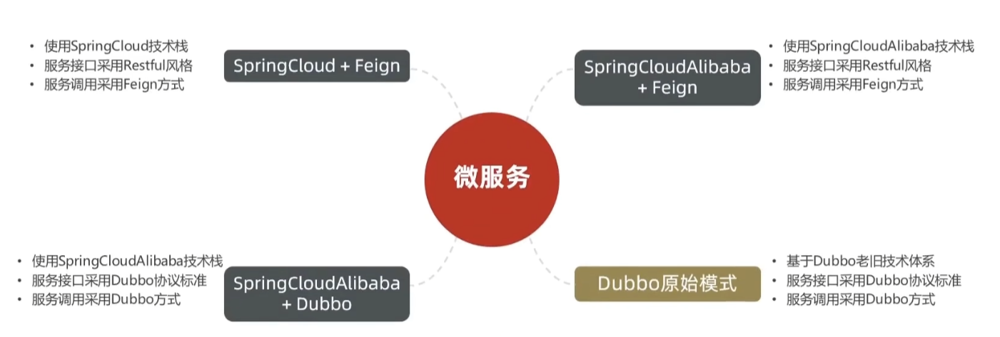
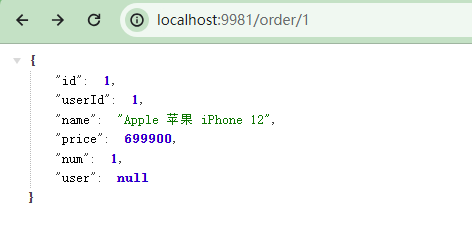
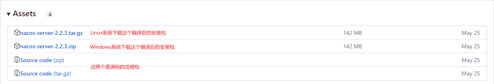
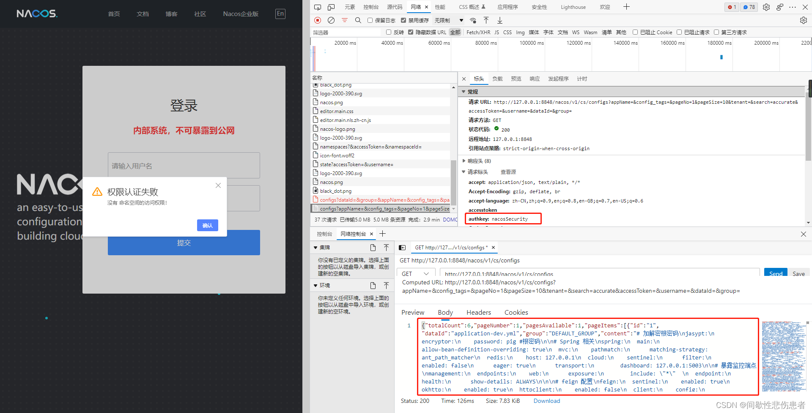
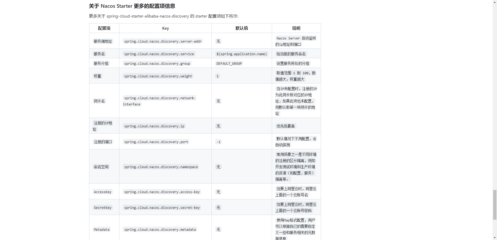
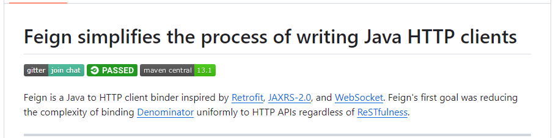

# 微服务前言


**微服务**只是**分布式架构**的一种！

分布式架构就是要把服务做拆分，而拆分的过程中会产生各种各样的问题需要解决，**Spring Cloud**只解决了服务拆分时的**服务治理**问题。


## 微服务技术栈

传统的**单体应用**，所有的业务功能全部写在一起，随着业务功能不断增加，代码耦合的越来越多，不利于将来的升级维护。


微服务在做拆分的时候，会根据业务功能模块将一个单体项目拆分成许多个独立的项目，每个项目完成一部分业务功能，将来独立开发和部署。

我们把这些独立的项目称之为**服务**。一个大型的微服务项目往往会包含数百甚至上千个服务，最终形成一个**服务集群**。


而一个业务往往需要由多个服务共同完成，例如一个请求来了，它可能先去调用服务A，随后服务A会调用服务B，服务B又会调用服务C。

当业务越来越多，越来越复杂的时候，这些服务之间的调用关系就会越来越复杂，而这些复杂的调用关系光靠人去记录和维护这是不可能的。


这个时候就需要用到**注册中心**，它可以去记录每一个服务的IP、端口和功能这些信息。

当有一个服务需要调用另外的服务时，只需要到注册中心中去拉取对应的服务信息。


另外，随着服务越来越多，每个服务都有自己的配置文件，如果我们需要更改配置，逐一更改太麻烦了，所以就需要用到**配置中心**。

它可以去统一管理整个服务集群的成千上百的配置，如果我们需要变更某些配置，只需要通过配置中心去通知相关的微服务实现配置的**热更新**。


当我们的微服务运行起来以后，用户就可以来访问我们了，但是这个时候还需要一个**网关组件**。（就像小区保安，拦截不法分子、指明住户住所）

因为我们有这么多的微服务，用户怎么知道该访问哪一个呢？（**网关组件功能1**：需要把用户的请求路由到具体的服务，同时还可以做**负载均衡**）

而且也不是随便什么人都可以访问我们的微服务的。（**网关组件功能2**：需要对用户的身份做校验）


用户发起访问请求后，服务接到请求就开始处理业务，该访问数据库的时候就会去访问**数据库集群**。


但无论数据库集群有多庞大也不可能有用户多，所以数据库肯定无法抗住高的并发。因此就需要加入**分布式缓存**，它也是一个集群。

缓存会把数据库的数据放到内存中，从而提高查询效率。

通过分布式缓存就可以应对高并发了，用户请求会先查询缓存，缓存未命中了再去查询数据库，从而降低了数据库的查询压力。


以后我们的业务中还会有一些复杂的搜索功能。简单查询可以做缓存，但是一些海量数据的复杂搜索、统计分析无法用缓存去实现，此时就需要用到**分布式搜索**。

数据库的主要职责就是做数据的 **写** 操作，以及一些**事务**类型的，对数据安全要求比较高的数据存储。


最后，在微服务中还需要一种**异步通信**的**消息队列**组件。

因为对于分布式服务（或微服务）来说，它的业务往往会跨越多个服务，例如一个请求来了先调用了服务A，服务A再调用服务B，服务B再调用服务C……这就会导致整个业务的链路很长，从而**调用时长=每个服务的执行时长之和**，所以其性能是有一定的下降的。

而异步通信的意思就是，请求调用服务A之后，服务A不再直接调用服务B，而是通知服务B执行（即发送一条通知消息），随后服务A就直接结束了。这就使得业务链路缩短，响应时间也缩短，进而分布式服务（或微服务）的吞吐能力变强。

- 其中服务A发送的通知消息就存储在消息队列组件中，服务B只有在接收到该消息时才会去执行。（同理，服务B调用服务C也是通知）

所以异步通信能够大大提高我们服务的并发，在一些像“秒杀”这样的高并发场景下就可以去利用了。


当然，如此庞大且复杂的一个服务，在运行的过程中如果出现什么问题是不太好排查的。所以我们需要引入两个新的组件，来解决运行过程中服务的异常定位。

1.**分布式日志服务**：负责统计整个集群中成千上百个服务的运行日志，统一去做存储、统计、分析，方便快速定位服务运行过程中出现的问题。

2.**系统监控+链路追踪**：实时监控整个集群中每个服务节点的运行状态、CPU的负载、内存的占用等情况，一旦出现任何问题，直接可以定位到具体的某一个方法（栈信息），从而帮助我们快速定位到异常所在。


如此庞大且复杂的一个微服务集群，将来其中的服务数量可能上万，届时如何**部署**将成为一个问题。人工部署显然不现实，那么就需要考虑**自动化部署**。

1.**Jenkins**：可以帮助我们对这些微服务项目进行自动化编译

2.**Docker**：基于docker做一些打包，形成镜像

3.**kubernetes**：实现自动化部署

4.**RANCHER**：同上

以上这一套我们称之为**持续集成**


### 分类总结


由浅入深，可以将微服务技术栈做如下分层


# 微服务架构

## 认识微服务

### 1.服务架构演变

==单体架构==：将业务的所有功能集中在一个项目中开发，打成一个包部署。

优点：架构简单；部署成本低。


缺点：耦合度高


==分布式架构==：根据业务功能对系统进行拆分，每个业务模块作为独立项目开发，称为一个服务。

优点：降低服务耦合度；有利于服务升级拓展


（服务治理）分布式架构要考虑的问题：

- 服务拆分粒度如何？
- 服务集群地址如何维护？
- 服务之间如何实现远程调用？
- 服务健康状态如何感知？

为了解决上述问题，诞生了很多解决方案，其中应用最广泛且最火热的就是<span style="color:red;">**微服务**</span>方案：


> 微服务是一种经过良好架构设计的**分布式**架构方案，微服务架构特征：
>
> - 单一职责：微服务拆分粒度更小，每一个服务都对应唯一的业务功能，做到单一职责，避免重复业务开发
> - 面向服务：微服务对外暴露业务接口
> - 自治：团队独立、技术独立、数据独立、部署独立
> - 隔离性：服务调用做好隔离、容错、降级，避免出现级联问题


==总结：==

单体架构特点：

- 简单方便，高度耦合，扩展性差，适合小型项目
- 例如：学生管理系统

分布式架构特点：

- 松耦合，扩展性好，但架构复杂，难度大。适合大型互联网项目
- 例如：京东、淘宝

微服务：一种良好的分布式架构方案

- 优点：拆分粒度更小、服务更独立、耦合度更低
- 缺点：架构非常复杂，运维、监控、部署难度更高


### 2.SpringCloud

#### 微服务技术对比

微服务这种方案需要技术框架来落地，全球的互联网公司都在积极尝试自己的微服务落地技术。国内最知名的就是 <span style="color:red;">**SpringCloud**</span> 和 Alibaba的 <span style="color:red;">**Dubbo**</span> 。

|                |         Dubbo         |       SpringCloud        |    SpringCloudAlibaba    |
| :------------: | :-------------------: | :----------------------: | :----------------------: |
|    注册中心    |   zookeeper、Redis    |      Eureka、Cousul      |      Nacos、Eureka       |
|  服务远程调用  |       Dubbo协议       |    Feign（http协议）     |       Dubbo、Feign       |
|    配置中心    |          无           |   Spring Cloud Config    | SpringCloudConfig、Nacos |
|    服务网关    |          无           | SpringCloudGateway、Zuul | SpringCloudGateway、Zuul |
| 服务监控和保护 | dubbo-admin（功能弱） |         Hystrix          |         Sentinel         |

企业中可能使用到的技术组合如下：



==**SpringCloudAlibaba** 本质上是按照 **SpringCloud** 标准实现的，可以认为它是 **SpringCloud** 中的一部分。==


#### SpringCloud

[SpringCloud](https://spring.io/projects/spring-cloud) 是目前国内使用最广泛的微服务框架。

**SpringCloud** 集成了各种微服务功能组件，并基于 **SpringBoot** 实现了这些组件的<span style="color:red;">自动装配</span>，从而提供了良好的开箱即用体验：


**SpringCloud** 与 **SpringBoot** 的版本兼容关系如下：


## 分布式服务架构案例

### 服务拆分

> ==服务拆分时需要注意的事项：==
>
> 1.不同服务，不要重复开发相同业务
>
> 2.各服务数据独立，不要访问其它服务的数据库
>
> 3.服务可以将自己的业务暴露为接口，供其它服务调用

拆分案例：cloud-demo

#### 1.建库建表 cloud_order


```sql
/*
 Navicat Premium Data Transfer

 Source Server         : local-db
 Source Server Type    : MySQL
 Source Server Version : 80016
 Source Host           : localhost:3306
 Source Schema         : cloud_order

 Target Server Type    : MySQL
 Target Server Version : 80016
 File Encoding         : 65001

 Date: 23/11/2023 16:03:17
*/

SET NAMES utf8mb4;
SET FOREIGN_KEY_CHECKS = 0;

-- ----------------------------
-- Table structure for tb_order
-- ----------------------------
DROP TABLE IF EXISTS `tb_order`;
CREATE TABLE `tb_order`  (
  `id` bigint(20) NOT NULL AUTO_INCREMENT COMMENT '订单id',
  `user_id` bigint(20) NOT NULL COMMENT '用户id',
  `name` varchar(128) CHARACTER SET utf8mb4 COLLATE utf8mb4_general_ci NULL DEFAULT NULL COMMENT '商品名称',
  `price` decimal(10, 2) NOT NULL COMMENT '商品价格',
  `num` int(11) NULL DEFAULT 0 COMMENT '商品数量',
  PRIMARY KEY (`id`) USING BTREE,
  UNIQUE INDEX `ordername`(`name`) USING BTREE
) ENGINE = InnoDB AUTO_INCREMENT = 9 CHARACTER SET = utf8mb4 COLLATE = utf8mb4_general_ci ROW_FORMAT = Dynamic;

-- ----------------------------
-- Records of tb_order
-- ----------------------------
INSERT INTO `tb_order` VALUES (1, 1, 'Apple 苹果 iPhone 12', 699900.00, 1);
INSERT INTO `tb_order` VALUES (2, 2, '雅迪 yadea 新国标电动车', 20990.00, 1);
INSERT INTO `tb_order` VALUES (3, 3, '骆驼（CAMEL） 休闲运动服', 43900.00, 1);
INSERT INTO `tb_order` VALUES (4, 4, '小米14 Pro 双模5G 骁龙8第三代', 35900.00, 1);
INSERT INTO `tb_order` VALUES (5, 5, 'OPPO Reno3 Pro 双模5G', 299900.00, 1);
INSERT INTO `tb_order` VALUES (6, 6, '美的（Midea）新能效空调', 544900.00, 1);
INSERT INTO `tb_order` VALUES (7, 2, '西昊/SIHOO 人体工学椅', 79900.00, 1);
INSERT INTO `tb_order` VALUES (8, 3, '梵班（FAMDBANN）', 31900.00, 1);

SET FOREIGN_KEY_CHECKS = 1;
```


#### 2.建库建表 cloud_user


```sql
/*
 Navicat Premium Data Transfer

 Source Server         : local-db
 Source Server Type    : MySQL
 Source Server Version : 80016
 Source Host           : localhost:3306
 Source Schema         : cloud_user

 Target Server Type    : MySQL
 Target Server Version : 80016
 File Encoding         : 65001

 Date: 23/11/2023 16:03:29
*/

SET NAMES utf8mb4;
SET FOREIGN_KEY_CHECKS = 0;

-- ----------------------------
-- Table structure for tb_user
-- ----------------------------
DROP TABLE IF EXISTS `tb_user`;
CREATE TABLE `tb_user`  (
  `id` bigint(20) NOT NULL AUTO_INCREMENT,
  `username` varchar(128) CHARACTER SET utf8mb4 COLLATE utf8mb4_general_ci NULL DEFAULT NULL COMMENT '收件人',
  `address` varchar(255) CHARACTER SET utf8mb4 COLLATE utf8mb4_general_ci NULL DEFAULT NULL COMMENT '地址',
  PRIMARY KEY (`id`) USING BTREE,
  UNIQUE INDEX `username`(`username`) USING BTREE
) ENGINE = InnoDB AUTO_INCREMENT = 7 CHARACTER SET = utf8mb4 COLLATE = utf8mb4_general_ci ROW_FORMAT = Dynamic;

-- ----------------------------
-- Records of tb_user
-- ----------------------------
INSERT INTO `tb_user` VALUES (1, '柳岩', '湖南省衡阳市');
INSERT INTO `tb_user` VALUES (2, '文二狗', '陕西省西安市');
INSERT INTO `tb_user` VALUES (3, '雨化田', '湖北省十堰市');
INSERT INTO `tb_user` VALUES (4, '张必沉', '天津市');
INSERT INTO `tb_user` VALUES (5, '郑爽爽', '辽宁省沈阳市大东区');
INSERT INTO `tb_user` VALUES (6, '范冰冰', '山东省青岛市');

SET FOREIGN_KEY_CHECKS = 1;
```


#### 3.建项目


- 创建父工程 cloud_demo，pom文件如下：

```xml
<?xml version="1.0" encoding="UTF-8"?>
<project xmlns="http://maven.apache.org/POM/4.0.0"
         xmlns:xsi="http://www.w3.org/2001/XMLSchema-instance"
         xsi:schemaLocation="http://maven.apache.org/POM/4.0.0 http://maven.apache.org/xsd/maven-4.0.0.xsd">
    <modelVersion>4.0.0</modelVersion>

    <groupId>com.djn</groupId>
    <artifactId>cloud-demo</artifactId>
    <packaging>pom</packaging>
    <version>1.0</version>
    <modules>
        <module>order-service</module>
        <module>user-service</module>
    </modules>

    <parent>
        <groupId>org.springframework.boot</groupId>
        <artifactId>spring-boot-starter-parent</artifactId>
        <version>2.6.4</version>
        <relativePath/>
    </parent>

    <properties>
        <project.build.sourceEncoding>UTF-8</project.build.sourceEncoding>
        <project.reporting.outputEncoding>UTF-8</project.reporting.outputEncoding>
        <java.version>1.8</java.version>
        <spring-cloud.version>2021.0.3</spring-cloud.version>
        <mysql.version>8.0.33</mysql.version>
        <mybatis.version>2.2.2</mybatis.version>
    </properties>

    <dependencyManagement>
        <dependencies>
            <!--SpringCloud-->
            <dependency>
                <groupId>org.springframework.cloud</groupId>
                <artifactId>spring-cloud-dependencies</artifactId>
                <version>${spring-cloud.version}</version>
                <type>pom</type>
                <scope>import</scope>
            </dependency>
            <!--数据库驱动 mysql-->
            <dependency>
                <groupId>mysql</groupId>
                <artifactId>mysql-connector-java</artifactId>
                <version>${mysql.version}</version>
            </dependency>
            <!--Mybatis-->
            <dependency>
                <groupId>org.mybatis.spring.boot</groupId>
                <artifactId>mybatis-spring-boot-starter</artifactId>
                <version>${mybatis.version}</version>
            </dependency>
        </dependencies>
    </dependencyManagement>

    <dependencies>
        <dependency>
            <groupId>org.projectlombok</groupId>
            <artifactId>lombok</artifactId>
        </dependency>
    </dependencies>
</project>
```

<span style="color:red;">**关于SpringCloud依赖坐标下的 type 标签和 scope 标签的作用**</span>

**Know1**：Maven项目的父子工程是**单继承**的，即一个 pom 文件中只能有一个 parent 标签

**Know2**：dependencyManagement 标签和 dependencies 标签的区别

> dependencyManagement里只是声明依赖，并不实现引入，因此子项目需要显式的声明需要用的依赖。如果不在子项目中声明依赖，是不会从父项目中继承下来的；只有在子项目中写了该依赖项，并且没有指定具体版本，才会从父项目中继承该项，并且version和scope都读取自父pom。另外如果子项目中指定了版本号，那么会使用子项目中指定的jar版本。
>
> dependencies即使在子模块中不写该依赖项，那么子模块仍然会从父项目中继承该依赖项（全部继承）。
>
> 链接：https://www.jianshu.com/p/c8666474cf9a

**Know3**：通过 `<type>pom</type>` 和 `<scope>import</import>` 可以解决Maven子工程单继承的问题。

 <span style="color:green;">**即 可以在我们的工程中引入多个 pom 工程的 dependencyManagement ，而非只有 parent 标签中的 pom 工程的 dependencyManagement**</span> 

首先，我这个 pom 文件是作为**其它子模块 pom 文件的<span style="color:red;">父类</span>**，在该模块下我使用 <span style="color:red;">parent</span> 标签继承了 SpringBoot 的**所有**依赖(但不是引入jar包！)，这样方便于版本管理。

其次，我<span style="color:red;">还要</span>在项目中用到 SpringCloud 的相关依赖，但是 <span style="color:red;">parent 标签已经被占用了，怎么办？</span>

这时我们就需要使用 ==\<dependencyManagement> + \<dependencies>== 来引入 SpringCloud 的相关依赖，也就是我们常说的需要解决“**Maven依赖单继承问题**”。

```xml
    <dependencyManagement>
        <dependencies>
            <!--SpringCloud-->
            <dependency>
                <groupId>org.springframework.cloud</groupId>
                <artifactId>spring-cloud-dependencies</artifactId>
                <version>${spring-cloud.version}</version>
                <type>pom</type>
                <scope>import</scope>
            </dependency>
        </dependencies>
	</dependencyManagement>
```

一个一个导入会很麻烦而且会使 pom 文件过大，所以官方提供了一个依赖合集——直接引入 **spring-cloud-dependencies**，<span style="color:red;">**即整个cloud的全套的依赖！！**</span>

这样就解决了单继承的问题。要注意的是 `<scope>import</scope>` 必须在 \<dependencyManagement> 下使用并且==<span style="color:red;">必须</span>==声明 `<type>pom</type>` 。

> 当一个父 pom 中的 dependencyManagement 标签中需要导入另一个 pom 中的 dependencyManagement 的时候（此处是想引入 **spring-cloud-dependencies** 工程中的<dependencyManagement>）,则必须同时使用 `<scope>import</scope>` 和 `<type>pom</type>`

==注意：==dependencyManagement 只在父工程（即 pom 类型的 Maven 工程）中声明有效，然后在子工程中引入依赖无需声明版本。**如果在 jar 类型的 maven 工程中添加了 dependencyManagement 是<span style="color:red;">没有意义</span>的。**


- 创建子模块 order_service

pom.xml

```xml
<?xml version="1.0" encoding="UTF-8"?>
<project xmlns="http://maven.apache.org/POM/4.0.0"
         xmlns:xsi="http://www.w3.org/2001/XMLSchema-instance"
         xsi:schemaLocation="http://maven.apache.org/POM/4.0.0 http://maven.apache.org/xsd/maven-4.0.0.xsd">
    <parent>
        <artifactId>cloud-demo</artifactId>
        <groupId>com.djn</groupId>
        <version>1.0</version>
    </parent>
    <modelVersion>4.0.0</modelVersion>

    <artifactId>order-service</artifactId>

    <dependencies>
        <dependency>
            <groupId>org.springframework.boot</groupId>
            <artifactId>spring-boot-starter-web</artifactId>
        </dependency>
        <dependency>
            <groupId>mysql</groupId>
            <artifactId>mysql-connector-java</artifactId>
        </dependency>
        <dependency>
            <groupId>org.mybatis.spring.boot</groupId>
            <artifactId>mybatis-spring-boot-starter</artifactId>
        </dependency>
    </dependencies>

    <build>
        <plugins>
            <plugin>
                <groupId>org.springframework.boot</groupId>
                <artifactId>spring-boot-maven-plugin</artifactId>
            </plugin>
        </plugins>
    </build>
</project>
```

application.yml

```yaml
server:
  port: 9981
spring:
  datasource:
    url: jdbc:mysql://localhost:3306/cloud_order?useUnicode=true&characterEncoding=utf8&zeroDateTimeBehavior=convertToNull&useSSL=false&serverTimezone=Asia/Shanghai
    username: root
    password: 1234
    driver-class-name: com.mysql.cj.jdbc.Driver
mybatis:
  type-aliases-package: com.djn.order.domain
  configuration:
    map-underscore-to-camel-case: true
  mapper-locations: classpath*:mapper/*Mapper.xml
logging:
  pattern:
    dateformat: MM-dd HH:ss:SSS
  level:
    com.djn: debug
```

==业务代码详见项目代码==


- 创建子模块 user_service

pom.xml

```xml
<?xml version="1.0" encoding="UTF-8"?>
<project xmlns="http://maven.apache.org/POM/4.0.0"
         xmlns:xsi="http://www.w3.org/2001/XMLSchema-instance"
         xsi:schemaLocation="http://maven.apache.org/POM/4.0.0 http://maven.apache.org/xsd/maven-4.0.0.xsd">
    <parent>
        <artifactId>cloud-demo</artifactId>
        <groupId>com.djn</groupId>
        <version>1.0</version>
    </parent>
    <modelVersion>4.0.0</modelVersion>

    <artifactId>user-service</artifactId>

    <dependencies>
        <dependency>
            <groupId>org.springframework.boot</groupId>
            <artifactId>spring-boot-starter-web</artifactId>
        </dependency>
        <dependency>
            <groupId>mysql</groupId>
            <artifactId>mysql-connector-java</artifactId>
        </dependency>
        <dependency>
            <groupId>org.mybatis.spring.boot</groupId>
            <artifactId>mybatis-spring-boot-starter</artifactId>
        </dependency>
    </dependencies>

    <build>
        <finalName>app</finalName>
        <plugins>
            <plugin>
                <groupId>org.springframework.boot</groupId>
                <artifactId>spring-boot-maven-plugin</artifactId>
            </plugin>
        </plugins>
    </build>
</project>
```

application.yml

```yaml
server:
  port: 8864
spring:
  datasource:
    url: jdbc:mysql://localhost:3306/cloud_user?useUnicode=true&characterEncoding=utf8&zeroDateTimeBehavior=convertToNull&useSSL=false&serverTimezone=Asia/Shanghai
    username: root
    password: 1234
    driver-class-name: com.mysql.cj.jdbc.Driver
mybatis:
  type-aliases-package: com.djn.user.domain
  configuration:
    map-underscore-to-camel-case: true
  mapper-locations: classpath*:mapper/*Mapper.xml
logging:
  pattern:
    dateformat: MM-dd HH:ss:SSS
  level:
    com.djn: debug
```

==业务代码详见项目代码==


#### 4.启动测试

分别访问两个服务的接口，得到如下结果

http://localhost:9981/order/1



http://localhost:8864/user/1


### 远程调用

案例：根据订单id查询订单的同时，把订单所属的用户信息一起返回


远程调用方式分析


既然浏览器、Ajax都可以发起http请求，那么服务也可以。Spring提供了一个工具 <span style="color:red;">RestTemplate</span> 供我们发起各种http请求！

#### 1.注册RestTemplate

在order-service的**OrderApplication**中注册RestTemplate

```java
@MapperScan("com.djn.order.mapper")
@SpringBootApplication
public class OrderApplication {

    public static void main(String[] args) {
        SpringApplication.run(OrderApplication.class, args);
    }

    /**
     * 创建RestTemplate并注入Spring
     *
     * @return org.springframework.web.client.RestTemplate
     * @date 2023/11/23 18:36
     */
    @Bean
    public RestTemplate restTemplate() {
        return new RestTemplate();
    }
}
```

#### 2.注入并使用

改造OrderServiceImpl，实现服务的远程调用

```java
@Service
public class OrderServiceImpl implements OrderService {

    @Resource
    private OrderMapper orderMapper;

    @Resource
    private RestTemplate restTemplate;

    @Override
    public Order queryOrderById(Long orderId) {
        //1.查询订单
        Order order = orderMapper.findById(orderId);
        //2.利用RestTemplate发起http请求
        //2.1拼接url路径
        String url = "http://localhost:8864/user/" + order.getUserId();
        //2.2发送http请求，实现远程调用
        User user = restTemplate.getForObject(url, User.class);
        //3.封装User到Order
        order.setUser(user);
        //4.返回
        return order;
    }
}
```

#### 3.调用结果


## Eureka注册中心

### 提供者与消费者

服务提供者：一次业务中，被其他服务调用的服务（提供接口给其它服务）

服务消费者：一次业务中，调用其它服务的服务（调用其它服务提供的接口）

~一个服务既可以是提供者，也可以是消费者。例如：当服务A调用服务B，服务B再调用服务C的时候，服务B既是A的提供者，又是C的消费者。~


### Eureka原理分析

#### 远程调用出现的问题

在 **cloud-demo** 的服务拆分案例中，我们在实现远程调用时，是把调用服务的url在代码中写死的，这样非常不灵活。

> 在实际工作中，我们会有 *开发环境* 、*测试环境* 、*生产环境*  等多个环境，在不同的环境中我们服务的地址也会发生变化。如果使用硬编码的方式，每次更换环境都需要我们手动修改地址，重新编译打包，这样非常的麻烦。
>
> 为了将来应对更多的并发，我们的每一种服务都有可能部署多个实例，形成一个集群。此时我们调用的服务的url就变得不确定了，硬编码的方式也变得不切实际了。
>
> - ==那么我们的服务消费者该如何获取服务提供者的地址信息？==
>
> - ==如果有多个服务者，消费者该如何选择？==
> - ==消费者如何得知服务提供者的健康状态？==


#### Eureka的作用

在Eureka的结构当中，存在两个概念：**eureka-server** 和 **eureka-client**。

其中 **注册中心** 就是 eureka-server，它的作用就是记录、管理这些微服务；而 **服务提供者&服务消费者** 统称为 eureka-client，它们每个服务在每次启动时都会把自己的信息注册到 eureka注册中心。


当有服务消费者想要“消费”的时候，就会到 eureka注册中心 拉取目标服务的信息。当目标服务有多个时，可以通过**负载均衡**挑选出一个目标服务以供“消费”。


当然，拉取的目标服务都是健康的，因为已经注册的服务每隔30秒都会向注册中心发送一次心跳，以此来确保自己是健康状态的。所以那些非健康状态的服务信息在被拉取之前就会被筛除掉。


#### 总结

在Eureka架构中，微服务角色有两类：

- EurekaServer：服务端，注册中心
    - 记录服务信息
    - 心跳监控
- EurekaClient：客户端
    - Provider：服务提供者，例如案例中的 user-service
        - 注册自己的信息到EurekaServer
        - 每隔30秒向EurekaServer发送心跳
    - Consumer：服务消费者，例如案例中的 order-service
        - 根据服务名称从EurekaServer拉取服务列表
        - 基于服务列表做负载均衡，选中一个微服务后发起远程调用


### Eureka实用案例

搭建EurekaServer ——> 将user-service、order-service都注册到Eureka ——> 在order-service中完成服务拉取，然后通过负载均衡挑选一个服务实现远程调用

#### 1.搭建注册中心

①创建一个子模块 eureka-server，并引入eureka-server的相关依赖

```xml
<?xml version="1.0" encoding="UTF-8"?>
<project xmlns="http://maven.apache.org/POM/4.0.0"
         xmlns:xsi="http://www.w3.org/2001/XMLSchema-instance"
         xsi:schemaLocation="http://maven.apache.org/POM/4.0.0 http://maven.apache.org/xsd/maven-4.0.0.xsd">
    <modelVersion>4.0.0</modelVersion>
    <parent>
        <groupId>com.djn</groupId>
        <artifactId>cloud-demo</artifactId>
        <version>1.0</version>
    </parent>

    <artifactId>eureka-server</artifactId>

    <properties>
        <maven.compiler.source>8</maven.compiler.source>
        <maven.compiler.target>8</maven.compiler.target>
        <project.build.sourceEncoding>UTF-8</project.build.sourceEncoding>
    </properties>

    <dependencies>
        <!--eureka服务端-->
        <dependency>
            <groupId>org.springframework.cloud</groupId>
            <artifactId>spring-cloud-starter-netflix-eureka-server</artifactId>
        </dependency>
    </dependencies>

</project>
```

②编写启动类 `EurekaApplication`，添加 `@EnableEurekaServer` 注解

```java
package com.djn.eureka;

import org.springframework.boot.SpringApplication;
import org.springframework.boot.autoconfigure.SpringBootApplication;
import org.springframework.cloud.netflix.eureka.server.EnableEurekaServer;

@EnableEurekaServer
@SpringBootApplication
public class EurekaApplication {

    public static void main(String[] args) {
        SpringApplication.run(EurekaApplication.class, args);
    }
}
```

③添加 `application.yml` 文件，编写如下配置

```yaml
server:
  port: 10086 # 服务端口

# 为 Eureka自身的服务注册 而做的配置
spring:
  application:
    name: eurekaServer # Eureka的服务名称
eureka:
  client:
    service-url: # eureka的地址信息
      defaultZone: http://127.0.0.1:10086/eureka
```

==tips：== eureka-server 本质也是一个服务，所以它在启动时会将自身也注册到 eureka 上（这是为了方便将来eureka集群之间的通信），

这就要求我们配置 **defaultZone** 这个属性（单机eureka时只需要写一个地址，eureka集群时配置多个地址用逗号隔开）。

④启动项目并访问url：http://localhost:10086/


图中，EUREKA_SERVER 服务实例的 Status 一栏中的<span style="color:red;">“UP”表示正常状态</span>，如果是<span style="color:blue;">“DOWN”则表示该服务挂掉了</span>。


#### 2.服务注册

需求：将 user-service 服务注册到 eureka-server

①在 user-service 的 pom 文件中引入如下依赖

```xml
<!--eureka客户端-->
<dependency>
    <groupId>org.springframework.cloud</groupId>
    <artifactId>spring-cloud-starter-netflix-eureka-client</artifactId>
</dependency>
```

②在 application.yml 文件中编写如下配置

```yaml
spring:
  application:
    name: userService # user服务的服务名称
eureka:
  client:
    service-url: # eureka的地址信息
      defaultZone: http://127.0.0.1:10086/eureka/
```

③ order-service 的注册步骤同理，启动项目后到 eureka 中查看注册的服务实例


④==如何启动多个相同的服务==

我们可以将一个服务多次启动，模拟多实例部署，但为了避免端口冲突，需要修改端口配置：

第一步：


第二步：


第三步：


最终效果：


#### 3.服务发现

需求：在 order-service 完成服务拉取

~服务拉取是基于服务名称获取服务列表，然后再对服务列表做负载均衡~

①修改 order-service 的代码，修改访问user服务的url路径：用服务名称代替ip、端口

```java
String url = "http://userservice/user/" + order.getUserId();
```

②在 order-service 项目的启动类中注册RestTemplate时，添加**负载均衡**注解

```java
@Bean
@LoadBalanced
public RestTemplate restTemplate() {
    return new RestTemplate();
}
```

③重启 order-service 项目后，对服务接口进行多次访问，可以看到每次访问都会<span style="color:red;">通过负载均衡做不同的 user-service 服务调用</span>


## 负载均衡

SpringCloud 中的负载均衡一开始是由一个名为 Ribbon 的组件实现的；<span style="color:red;">**但由于 Ribbon 已经停更，SpringCloud 在 Hoxton.M2 版本将 Ribbon 移除，并使用 SpringCloud Loadbalancer作为其替代品！**</span>


二者区别

|           组件           | 组件提供的负载策略                                           | 支持负载的客户端                            |
| :----------------------: | :----------------------------------------------------------- | :------------------------------------------ |
|          Ribbon          | 轮询、随机、重试策略、权重优先策略、<br/>BestAvailableRule：会先过滤掉由于多次访问故障而处于断路器跳闸状态的服务，然后选择一个并发量最小的服务、<br/>AvailabilityFilterRule：先过滤掉故障实例，再选择并发较小的实例、<br/>ZoneAvoidanceRule：默认规则，复合判断server所在区域的性能和server的可用性选择服务器 | Feign或OpenFeign、RestTemplate等Web调用工具 |
| SpringCloud Loadbalancer | 轮询、随机                                                   | Ribbon所支持的、WebClient                   |

LoadBalancer 的优势主要是，支持**响应式编程**的方式**异步访问**客户端，依赖 Spring Web Flux 实现客户端负载均衡调用。


### 负载均衡原理

*负载均衡的流程*（图中SpringCloud版本较低，所以还在使用Ribbon做负载均衡）


在 Eureka实用案例 中，做“服务发现”时我们在给 RestTemplate 注册时加上了**负载均衡**注解


在 `LoadBalancerAutoConfiguration` 自动配置类中会给标有 @LoadBalanced 注解的 RestTemplate 添加一个负载均衡拦截器，这样就能通过 **LoadBalancerInterceptor** 去添加负载均衡策略

```java
/**
 * 对 阻塞客户端负载均衡 的自动配置
 * Auto-configuration for blocking client-side load balancing.
 *
 * @author Spencer Gibb
 * @author Dave Syer
 * @author Will Tran
 * @author Gang Li
 * @author Olga Maciaszek-Sharma
 */
@Configuration(proxyBeanMethods = false)
@ConditionalOnClass(RestTemplate.class)
@ConditionalOnBean(LoadBalancerClient.class)
@EnableConfigurationProperties(LoadBalancerClientsProperties.class)
public class LoadBalancerAutoConfiguration {

    /**
     * 会注入标有 @LoadBalanced 注解的 RestTemplate
     */
	@LoadBalanced
	@Autowired(required = false)
	private List<RestTemplate> restTemplates = Collections.emptyList();

	@Autowired(required = false)
	private List<LoadBalancerRequestTransformer> transformers = Collections.emptyList();

    // 函数名：负载均衡RestTemplate初始化器弃用后，返回智能初始化单例对象
    // 推测：该函数的作用是 注册一个 “当RestTemplate设置负载均衡拦截器失败后，会被调用来给RestTemplate设置负载均衡拦截器” 的单实例对象
	@Bean
	public SmartInitializingSingleton loadBalancedRestTemplateInitializerDeprecated(
			final ObjectProvider<List<RestTemplateCustomizer>> restTemplateCustomizers) {
		return () -> restTemplateCustomizers.ifAvailable(customizers -> {
			for (RestTemplate restTemplate : LoadBalancerAutoConfiguration.this.restTemplates) {
				for (RestTemplateCustomizer customizer : customizers) {
					customizer.customize(restTemplate);
				}
			}
		});
	}

	@Bean
	@ConditionalOnMissingBean
	public LoadBalancerRequestFactory loadBalancerRequestFactory(LoadBalancerClient loadBalancerClient) {
		return new LoadBalancerRequestFactory(loadBalancerClient, this.transformers);
	}

    // 在静态内部类中 配置负载均衡拦截器 和 RestTemplate定制器
	@Configuration(proxyBeanMethods = false)
	@Conditional(RetryMissingOrDisabledCondition.class)
	static class LoadBalancerInterceptorConfig {

		@Bean
		public LoadBalancerInterceptor loadBalancerInterceptor(LoadBalancerClient loadBalancerClient,
				LoadBalancerRequestFactory requestFactory) {
            // 返回创建的 LoadBalancerInterceptor 负载均衡拦截器实例对象
			return new LoadBalancerInterceptor(loadBalancerClient, requestFactory);
		}

		@Bean
		@ConditionalOnMissingBean
		public RestTemplateCustomizer restTemplateCustomizer(final LoadBalancerInterceptor loadBalancerInterceptor) {
            // 给 RestTemplate 添加 LoadBalancerInterceptor 负载均衡拦截器
			return restTemplate -> {
				List<ClientHttpRequestInterceptor> list = new ArrayList<>(restTemplate.getInterceptors());
				list.add(loadBalancerInterceptor);
				restTemplate.setInterceptors(list);
			};
		}

	}
    
    // 略...
}
```

负责执行拦截动作的是 **LoadBalancerInterceptor** 类


**LoadBalancerInterceptor** 实现了 **ClientHttpRequestInterceptor** 接口。


当我们给 **LoadBalancerInterceptor** 的 *intercept* 方法打上断点后，会发现它拦截了 RestTemplate 发起的HTTP请求


在SpringCloud Loadbalancer 替代 Ribbon 后，上图中负责执行负载均衡策略的实现类也就从 **RibbonLoadBalancerClient** 变成了 **BlockingLoadBalanerClient**，在实现类的 *execute* 方法中会执行负载均衡策略


把断点打到 *choose* 方法中后，可以看到其实是通过 **RoundRobinLoadBalancer** 的负载均衡策略来获取最终的目标服务实例的


通过 `Ctrl` + `H` 我们可以看到 **ReactiveLoadBalancer** 的层级结构如下，其中 **RoundRobinLoadBalancer** 是它的<span style="color:red;">子实现类</span>


在 **RoundRobinLoadBalancer** 中，是如何获取到 Eureka 中注册的服务列表的呢？


#### 时序流程图

==对 RestTemplate 请求调用时经过的类流程图如下：==


*负载均衡的详细流程*


### 负载均衡策略

Ribbon 的负载均衡规则是一个叫做 **IRule** 的接口来定义的，每一个子接口都是一种规则


这些负载均衡策略如下

|                内置负载均衡规则类                 |                           规则描述                           |
| :-----------------------------------------------: | :----------------------------------------------------------: |
|                  RoundRobinRule                   |  简单轮训服务列表来选择服务器，它是Ribbon默认的负载均衡规则  |
|             AvailabilityFilteringRule             | 对以下两种服务器进行忽略：<br>(1)在默认情况下，这台服务器如果3次连接失败，这台服务器就会被设置为“短路”状态。短路状态将持续30秒，如果再次连接失败，短路的持续时间就会几何级地增加。<br>(2)并发数过高的服务器。如果一个服务器的并发连接数过高，配置了AvailabilityFilteringRule规则的客户端也会将其忽略。并发连接数的上限，可以由客户端的\<clientName>.\<clientConfigNameSpace>.ActiveConnectionsLimit属性进行配置。 |
|              WeightResponseTimeRule               | 为每一个服务器赋予一个权重值。服务器响应时间越长，这个服务器的权重就越小。这个规则会随机选择服务器，这个权重值会影响服务器的选择。 |
| <span style="color:red;">ZoneAvoidanceRule</span> | 以区域可用的服务器为基础进行服务器的选择。使用Zone对服务器进行分类，这个Zone可以理解为一个机房、一个机架等。而后再对Zone内的多个服务做轮询。 |
|                 BestAvailableRule                 |       忽略那些短路的服务器，并返回并发数较低的服务器。       |
|                    RandomRule                     |                  随机选择一个可用的服务器。                  |
|                     RetryRule                     |                     重试机制的选择逻辑。                     |

通过定义IRule实现，可以修改负载均衡规则，有两种方式：

1.代码方式：在 order-service 中的 OrderApplication 类中，定义一个新的IRule

==此方式可以改变所有 order-service 调用的服务的负载均衡策略==

```java
@Bean
public IRule randomRule() {
    return new RandomRule();
}
```

2.配置文件方式：在 order-service 的 application.yml 文件中，添加新的配置也可以修改规则

==此方式可以改变指定服务的负载均衡策略==

```yaml
userservice:
  ribbon:
    NFLoadBalancerRuleClassName: com.netflix.loadbalancer.RandomRule # 负载均衡规则
```


#### 新版本SpringCloud自定义负载均衡策略

> 2020年前的SpringCloud是采用Ribbon作为负载均衡实现的，
>
> 但是2020后采用了LoadBalancer作为替代！

LoadBalancer 默认提供了两种负载均衡策略：

- **RandomLoadBalancer** —— 随机分配策略
- **RoundRobinLoadBalancer** —— 轮询分配策略（默认）

[参考文章](https://blog.csdn.net/gsls200808/article/details/132603527)


##### 1.切换 RandomLoadBalancer 策略

①新建配置类 CustomLoadBalancerConfiguration.java


（<span style="color:red;">不要加 @Configuration </span>，会导致 `environment.getProperty(LoadBalancerClientFactory.PROPERTY_NAME)` 返回 Null，后面调用RestTemplate失败）

```java
package com.djn.order.config;

import org.springframework.cloud.client.ServiceInstance;
import org.springframework.cloud.loadbalancer.core.RandomLoadBalancer;
import org.springframework.cloud.loadbalancer.core.ReactorLoadBalancer;
import org.springframework.cloud.loadbalancer.core.RoundRobinLoadBalancer;
import org.springframework.cloud.loadbalancer.core.ServiceInstanceListSupplier;
import org.springframework.cloud.loadbalancer.support.LoadBalancerClientFactory;
import org.springframework.context.annotation.Bean;
import org.springframework.core.env.Environment;


/**
 * 自定义负载均衡策略配置类
 */
public class CustomLoadBalancerConfiguration {

    @Bean
    public ReactorLoadBalancer<ServiceInstance> randomLoadBalancer(Environment environment,
                                                                   LoadBalancerClientFactory factory) {
        String name = environment.getProperty(LoadBalancerClientFactory.PROPERTY_NAME);

        // 返回轮询负载均衡策略（默认）
        //return new RoundRobinLoadBalancer(factory.getLazyProvider(name, ServiceInstanceListSupplier.class), name);

        // 返回随机轮询负载均衡策略
        return new RandomLoadBalancer(factory.getLazyProvider(name, ServiceInstanceListSupplier.class), name);
    }
}
```

==[官方文档](https://docs.spring.io/spring-cloud-commons/docs/current/reference/html/#eager-loading-of-loadbalancer-contexts) 中也说明不能直接用 @Configuration==


②通过在启动类上（也可以在配置类上）添加 @LoadBalancerClient ，可以单独为某一个服务指定负载均衡策略。[参考文章](https://blog.51cto.com/knifeedge/5847505)

其中，**name 或 value** 为需要指定负载均衡策略的服务名称；**configuration** 为我们上面自定义的负载均衡策略配置类

```java
package com.djn.order;

import com.djn.order.config.CustomLoadBalancerConfiguration;
import org.mybatis.spring.annotation.MapperScan;
import org.springframework.boot.SpringApplication;
import org.springframework.boot.autoconfigure.SpringBootApplication;
import org.springframework.cloud.client.loadbalancer.LoadBalanced;
import org.springframework.cloud.loadbalancer.annotation.LoadBalancerClient;
import org.springframework.context.annotation.Bean;
import org.springframework.web.client.RestTemplate;

/**
 * OrderService启动类
 */
@LoadBalancerClient(name = "userService", configuration = CustomLoadBalancerConfiguration.class)
@MapperScan("com.djn.order.mapper")
@SpringBootApplication
public class OrderApplication {

    public static void main(String[] args) {
        SpringApplication.run(OrderApplication.class, args);
    }


    /**
     * 创建RestTemplate并注入Spring
     */
    @Bean
    @LoadBalanced
    public RestTemplate restTemplate() {
        return new RestTemplate();
    }
}
```

另外，我们也可以通过 @LoadBalancerClients 为所有服务指定统一的负载均衡策略。

```java
@LoadBalancerClients(defaultConfiguration= CustomLoadBalancerConfiguration.class)
```

最后，我们还可以通过 @LoadBalancerClient 与 @LoadBalancerClients 的组合使用，为多个服务指定统一的负载均衡策略。

```java
@LoadBalancerClients(value = {
    @LoadBalancerClient(value = "stores", configuration = StoresLoadBalancerClientConfiguration.class),
    @LoadBalancerClient(value = "customers", configuration = CustomersLoadBalancerClientConfiguration.class)
})
```

其中，**value** 为 @LoadBalancerClient 数组；**defaultConfiguration** 为默认的负载均衡策略配置。


③可以看到，现在调用 UserService 的负载均衡策略是 **RandomLoadBalancer**


##### 2.使用自定义负载均衡策略

如果我们想自定义策略，可以参考 **RoundRobinLoadBalancer** 类自己实现。例如：调用3次轮换的自定义策略

①创建 CustomLoadBalancer 类，实现自定义的负载均衡逻辑

```java
package com.djn.order.rule;

import org.apache.commons.logging.Log;
import org.apache.commons.logging.LogFactory;
import org.springframework.beans.factory.ObjectProvider;
import org.springframework.cloud.client.ServiceInstance;
import org.springframework.cloud.client.loadbalancer.DefaultResponse;
import org.springframework.cloud.client.loadbalancer.EmptyResponse;
import org.springframework.cloud.client.loadbalancer.Request;
import org.springframework.cloud.client.loadbalancer.Response;
import org.springframework.cloud.loadbalancer.core.ReactorServiceInstanceLoadBalancer;
import org.springframework.cloud.loadbalancer.core.ServiceInstanceListSupplier;
import reactor.core.publisher.Mono;

import java.util.List;

/**
 * 自定义负载均衡策略：每3次调用后轮换
 */
public class CustomLoadBalancer implements ReactorServiceInstanceLoadBalancer {

    private static final Log log = LogFactory.getLog(CustomLoadBalancer.class);

    /**
     * 被调用的次数
     */
    private int total = 0;

    /**
     * 当前提供服务的实例的索引
     */
    private int index = 0;

    private ObjectProvider<ServiceInstanceListSupplier> serviceInstanceListSupplierObjectProvider;

    private String serviceId;

    public CustomLoadBalancer(ObjectProvider<ServiceInstanceListSupplier> serviceInstanceListSupplierObjectProvider,
                              String serviceId) {
        this.serviceInstanceListSupplierObjectProvider = serviceInstanceListSupplierObjectProvider;
        this.serviceId = serviceId;
    }

    @Override
    public Mono<Response<ServiceInstance>> choose(Request request) {
        ServiceInstanceListSupplier supplier = serviceInstanceListSupplierObjectProvider.getIfAvailable();
        assert supplier != null;
        return supplier.get().next().map(this::getInstanceResponse);
    }

    private Response<ServiceInstance> getInstanceResponse(List<ServiceInstance> instances) {
        log.info("进入自定义负载均衡");

        if(instances.isEmpty()) {
            return new EmptyResponse();
        }

        log.info("每个服务访问3次后轮换");
        int size = instances.size();

        ServiceInstance serviceInstance = null;

        while (serviceInstance == null) {
            System.out.println("======" + total);
            System.out.println("======" + index);
            if (total < 3) {
                serviceInstance = instances.get(index);
                total++;
            } else {
                total = 0;
                index ++;
                if (index >= size) {
                    index = 0;
                }
                serviceInstance = instances.get(index);
            }
        }

        return new DefaultResponse(serviceInstance);
    }
}
```

②修改 CustomLoadBalancerConfiguration 类，指定我们自定义的负载均衡策略

```java
/**
 * 自定义负载均衡策略配置类
 */
public class CustomLoadBalancerConfiguration {

    @Bean
    public ReactorLoadBalancer<ServiceInstance> randomLoadBalancer(Environment environment,
                                                                   LoadBalancerClientFactory factory) {
        String name = environment.getProperty(LoadBalancerClientFactory.PROPERTY_NAME);

        // 返回轮询负载均衡策略（默认）
        //return new RoundRobinLoadBalancer(factory.getLazyProvider(name, ServiceInstanceListSupplier.class), name);

        // 返回随机轮询负载均衡策略
        //return new RandomLoadBalancer(factory.getLazyProvider(name, ServiceInstanceListSupplier.class), name);

        // 返回自定义负载均衡策略
        return new CustomLoadBalancer(factory.getLazyProvider(name, ServiceInstanceListSupplier.class), name);
    }
}
```

③最终的运行结果如下


### 懒加载

**饥饿加载**

Ribbon 默认是采用”懒加载“的，即第一次访问时才会去创建LoadBalancerClient，这样请求的时间会很长。

而“饥饿加载”则会在项目启动时创建，降低第一次访问的耗时，通过下面的配置开启“饥饿加载”：

```yaml
ribbon:
  eager-load:
    enabled: true # 开启饥饿加载
    clients: # clients是一个集合，多服务的写法如下 
      - userservice # 指定对 userservice 这个服务进行饥饿加载
      - xxxservice
```


## Nacos注册中心

### 认识和安装Nacos

[Nacos](https://nacos.io/zh-cn/index.html) 是阿里巴巴的产品，现在是 SpringCloud 的一个组件。相比 Eureka 功能更加丰富，在国内受欢迎程度较高。


#### 安装Nacos

在 [官方文档](https://nacos.io/zh-cn/docs/v2/quickstart/quick-start.html) 中可以找到安装包的下载链接，选择版本后将安装包下载下来（这里下载的是2.2.3版本）



下载完成后将压缩文件解压


打开`conf`目录下的 application.properties 文件，修改 Nacos 的启动端口号（默认为 8848）


在`bin`目录下运行 cmd 窗口，执行以下命令即可成功启动Nacos

```shell
startup.cmd -m standalone
```

~其中-m指的是mode，standalone值代表以单机模式启动Nacos~

启动成功后的效果图如下


随后我们访问 Nacos 首页 http://localhost:8848/nacos/index.html


可以注意到，首页上方红框中的提示信息，官方文档中给出了如下的说明


由此可知，我们需要手动配置才能让Nacos启用登录功能，配置内容如下


修改完配置后，再次启动Nacos，可以看到出现了登录页面


==其中“身份识别键值对”的具体作用是什么呢？==

这两个属性是权限认证的配置项，用于标识来自其他服务器的请求。当一个请求的请求头中配置了指定的属性时，即可跳过权限认证。

[参考文章](https://blog.csdn.net/qq_41057885/article/details/125059535)

我们在开启Nacos权限认证后，调用 /nacos/v1/cs/configs 接口，会直接跳转到登录界面，且提示 <span style="color:red;">403</span>，服务器拒绝访问。


此时，我们选择编辑并重发该请求，向该请求头中新增 spring=stone 属性（这里填写我们配置文件中设置的键值对）。


此时，请求成功了，拿到了Nacos的配置管理列表。




### Nacos快速入门

[Spring官方手册](https://spring-cloud-alibaba-group.github.io/github-pages/2021/en-us/index.html#_more_information_about_nacos_discovery_starter_configurations)


[Nacos官方案例](https://nacos.io/zh-cn/docs/archive/use-nacos-with-springcloud.html)


如何查看SpringCloudAlibaba提供的Nacos服务发现案例


#### 服务的注册与发现

<span style="color:red;">在 SpringCloud组件中，有一个非常重要的模块——SpringCloudCommons，其主要作用就是 **定义接口规范** 的。</span>

其中 *DiscoveryClient* 接口定义了 “服务发现” 的规范；*ServiceRegistry* 接口定义了 “服务注册” 的规范，所以不论是 Eureka 还是 Nacos 都会在做服务注册发现时遵循这套接口规范。==因此，当我们把 cloud-demo 项目中的注册中心从 Eureka 更换为 Nacos 时，是不需要改动服务提供者和服务消费者的代码的！==


1.在 cloud-demo 父工程中添加 spring-cloud-alibaba 的管理依赖

```xml
<!--SpringCloudAlibaba-->
<dependency>
    <groupId>com.alibaba.cloud</groupId>
    <artifactId>spring-cloud-alibaba-dependencies</artifactId>
    <version>2021.0.4.0</version>
    <type>pom</type>
    <scope>import</scope>
</dependency>
```

SpringBoot和SpringCloudAlibaba的版本对应关系


2.注释掉 order-service 和 user-service 中原有的 Eureka 依赖，并添加 Nacos 的客户端依赖

```xml
<!--Nacos客户端-->
<dependency>
    <groupId>com.alibaba.cloud</groupId>
    <artifactId>spring-cloud-starter-alibaba-nacos-discovery</artifactId>
</dependency>
```


3.根据 “Nacos官方案例” 可知，我们还需要在**服务消费者**中单独引入**SpringCloudLoadbalancer**，

并做如下配置来启用**SpringCloudAlibaba**提供的Nacos负载均衡策略：


```xml
<dependencies>
    <dependency>
        <groupId>org.springframework.cloud</groupId>
        <artifactId>spring-cloud-loadbalancer</artifactId>
    </dependency>
</dependencies>
```

```yaml
spring:
  cloud:
    loadbalancer:
      nacos:
        enabled: true
      ribbon:
        enabled: false
```


4.修改 user-service 和 order-service 中的 application.yml 文件，注释 Eureka 地址，添加 Nacos 地址

```yaml
spring:
  cloud:
    nacos:
      server-addr: localhost:8848 # Nacos服务端地址
      discovery:
        username: nacos # Nacos开启权限验证后，需要设置登录用户名
        password: nacos # Nacos开启权限验证后，需要设置登录密码
        namespace: f20f0bdd-8b41-41a2-96c8-6aa946f903fc # 设置服务在Nacos中所属的命名空间ID
        group: stone1 # 设置服务在Nacos中所属的分组
```

- username 和 password：在安装Nacos的时候，我们开启了Nacos的鉴权功能，所以必须设置这两项，我们的服务才能成功注册到Nacos中。
- namespace：是 Nacos 针对于企业级开发设计用来针对于不同环境的区分。
    - 比如正在企业开发时有测试环境、生产环境等其他环境，为了保证不同环境配置实现隔离，提出了namespace的概念！
    - Nacos 中存在一个默认的命名空间 `public`，所有配置以及服务注册，在没有指定命名空间时都会默认从 `public` 这个命名空间拉取配置以及注册到该命名空间下的注册表中！！！
    - <span style="color:orange;">**同名的命名空间只能创建一个！**</span>
    - <span style="color:red;">**服务注册到不同的 namespace 下，服务间无法通过指定服务名进行负载通信！！！**</span>
    - <span style="color:red;">即服务间如果需要通信，则需要保证其discovery要在一个命名空间下（实际上一般都不会更改服务注册的命名空间）</span>


- group：在 Nacos 中，可以根据业务需求，对不同的服务以及配置进行分组，通过不同的字符串名（分组名）来表示不同的分组。
    - Nacos 中如果未显示的指明分组名，那么就会默认的划分在DEFAULT_GROUP分组之中！
    - <span style="color:red;">**Group间的服务仍然是隔离的，即服务注册到不同的分组时，无法通过指定服务名进行负载调用！**</span>

> 前边已经划分了各个区域（`namespace`）了，那还来个分组，是啥意思呢？
>
> 简单！零食区中，薯片是放一个柜的吧！！糖是放一个柜的吧！！鲫鱼与鲫鱼是在一起的吧！！猪排与猪排是在一起的吧！ 这便是分组，实际上也是一个更细微的环境隔离机制罢了！！！

[参考文章](https://blog.csdn.net/leilei1366615/article/details/111405644)

==关于 Nacos 的更过配置信息参考：== [Nacos Starter的更多配置项信息](https://github.com/alibaba/spring-cloud-alibaba/wiki/Nacos-discovery) 




5.启动测试，<span style="color:red;">在启动项目之前一定要先将 Nacos 服务端 启动起来！！！</span>


6.进行服务间的调用  http://localhost:9981/order/1

<span style="color:red;">**注意：**</span>Nacos 和 Eureka 不同，对于服务名称的书写要求很严格，

所以为了保证服务的成功调用，我们要确保代码中调用的服务名称和Nacos中注册的服务名称是一致的。


最终成功调用的结果如下


### Nacos服务分级存储模型

现在我们已经知道，一个服务是可以包含多个实例的。不过，随着我们业务规模越来越扩大，服务的实例也会增加，但是如果还像之前一样**把所有服务实例都部署在一个机器或者说一个机房中**，那么就像把所有鸡蛋都放在一个篮子里一样是很不安全的。

为了解决这个安全隐患，我们会**把一个服务的多个实例部署到多个机房**（一些有实力的企业还会将这些机房分别布置在不同地域），以此来实现<span style="color:red;">**容灾**</span>。


在 Nacos 服务分级存储模型中就引入了这样的“机房”概念，把某个 <span style="color:red;">服务</span> 在同一个机房的多个 <span style="color:red;">实例</span> 称之为 <span style="color:red;">“集群”</span> 。


#### 服务跨集群调用问题

==假设以下的情况：==

某公司在 **杭州** 和 **上海** 两个地域都部署了服务器机房，

然后将一个项目的 order-service 和 user-service 的服务实例部署到了这两个机房的服务器上。

此时，如果一个 order-service 实例想要访问 user-service 实例，那么会出现两种情况：

- 1.访问本地服务器上的 user-service 实例
- 2.访问异地服务器上的 user-service 实例

对比之下，本地服务器在物理距离上比较短，响应速度更快，延迟也就更低，而跨集群调用延迟较高。

所以<span style="color:red;">服务调用应该尽可能选择本地集群的服务</span>，只有当本地集群不可用时，再去考虑访问其他集群。

Nacos 引入”集群“的概念，就是为了<span style="color:blue;">**尽可能避免出现夸集群调用**</span>。


#### 为服务设置集群属性

1.修改 application.yml，添加如下内容

```yaml
spring:
  cloud:
    nacos:
      discovery:
        cluster-name: HZ # 配置集群名称，也就是机房位置，例如：HZ 杭州
```


2.在Nacos控制台可以看到集群变化


总结

1.Nacos服务分级存储模型

​	一级是服务，例如 UserService

​	二级是集群，例如杭州或上海

​	三级是实例，例如杭州房的某台部署了UserService实例的服务器

2.如何设置实例的集群属性：参照上文


#### Nacos 负载均衡策略

在“Nacos快速入门”章节中，我们已经知道了可以通过配置文件的方式来启用 Nacos 负载均衡策略 **NacosLoadBalancer** ，

```yaml
spring:
  cloud:
    loadbalancer:
      nacos:
        enabled: true
```

那么这个由 SpringCloud Alibaba 提供的负载均衡策略有什么特点呢？

<span style="color:blue;">**其最大的特点就是：能够让 服务消费者 在调用 服务提供者 时，优先选择同一个集群的服务提供者！**</span>

<span style="color:green;">当同一个集群的服务提供者有多个实例时，又会采用**随机**方式进行负载均衡！</span>

<span style="color:red;">只有当同一个集群中没有可以调用的服务实例时，才会去其他集群进行远程调用。</span>


除了配置文件的方式，我们还可以采用自定义负载均衡策略配置类的方式来启用 **NacosLoadBalancer**

```java
/**
 * 自定义负载均衡策略配置类
 */
public class CustomLoadBalancerConfiguration {

    @Bean
    public ReactorLoadBalancer<ServiceInstance> randomLoadBalancer(Environment environment,
                                                                   LoadBalancerClientFactory factory,
                                                                   NacosDiscoveryProperties properties) {
        String name = environment.getProperty(LoadBalancerClientFactory.PROPERTY_NAME);

        // 返回轮询负载均衡策略（默认）
        //return new RoundRobinLoadBalancer(factory.getLazyProvider(name, ServiceInstanceListSupplier.class), name);

        // 返回随机轮询负载均衡策略
        //return new RandomLoadBalancer(factory.getLazyProvider(name, ServiceInstanceListSupplier.class), name);

        // 返回自定义负载均衡策略
        //return new CustomLoadBalancer(factory.getLazyProvider(name, ServiceInstanceListSupplier.class), name);

        // 返回Nacos的负载均衡策略
        return new NacosLoadBalancer(factory.getLazyProvider(name, ServiceInstanceListSupplier.class), name, properties);
    }
}
```

==注意点==：我们自定义的负载均衡策略配置类会 <span style="color:red;">**覆盖**</span> application.yml 文件中的 `spring.cloud.loadbalancer.nacos.enabled=true` 属性的效果


#### 为服务设置权重属性

实际部署中会出现这样的场景：

- 服务器设备性能有差异，部分实例所在机器性能较好，另一些较差，我们希望性能好的机器承担更多的用户请求

Nacos 提供了权重配置来控制访问频率，权重越大则访问频率越高。在 Nacos 控制台可以设置实例的权重值：


将权重设置为0.1，测试可以发现该服务被访问的频率大大降低了。

OrderService被访问多次，


但是端口号7749的UserService却只被调用了2次！


### Nacos环境隔离

Nacos 中服务存储和数据存储的最外层都是一个名为 **namespace** 的东西，用来做最外层的隔离。

详见“ Nacos 快速入门”一节的“服务注册与发现”。


## 注册中心对比

### Nacos细节分析

1、服务消费者拉取服务信息的动作不是**按需执行**的，而是<span style="color:red;">**定时执行**</span>的，这样可以减小注册中心的压力。（==在Eureka中也是如此==）

每隔一定的时间（例如30s），服务消费者会向注册中心拉取一次最新的服务信息，并将它们缓存起来，然后在接下来的一段时间内直接从缓存中获取服务信息，这样就大大减小了注册中心承担的访问压力。

2、在 Nacos 中，服务实例会被划分成 <span style="color:red;">临时实例</span> 和 <span style="color:blue;">非临时实例</span>，两者的**健康检测机制**是不一样的。其中：

- 临时实例采用心跳检测（与Eureka相同），并且当临时实例挂掉时，它会被 Nacos 从列表中剔除。
- 非临时实例则由 Nacos 主动发请求询问，并且当非临时实例挂掉了，Nacos 会等待其恢复正常。


3、在服务信息的拉取方式上，Eureka 与 Nacos 是有区别的

Eureka 的服务信息只会由<span style="color:green;">服务消费者单方面的拉取</span>，这样的信息更新不够及时；

而 Nacos 采用了<span style="color:red;">服务消费者拉取 + 主动推送变更信息</span>二者相结合的方式。


### 非临时实例配置

服务注册到Nacos时，可以通过下面的配置来注册为非临时实例

```yaml
spring:
  cloud:
    nacos:
      discovery:
        ephemeral: false # 设置为非临时实例
```

我们可以在Nacos控制台中看到如下结果


其中端口号7749的服务实例健康状态异常，但是并没有被Nacos从列表中剔除掉。


### 总结

1.Nacos 与 Eureka 的共同点

- 都支持服务注册和服务拉取
- 都支持服务提供者心跳方式做健康检测

2.Nacos 与 Eureka 的区别

- Nacos 支持服务端主动检测提供者状态：临时实例采用心跳模式，非临时实例采用主动检测模式
- 临时实例心跳不正常会被剔除，非临时实例则不会被剔除
- Nacos 支持服务列表变更的消息推送模式，服务列表更新更及时
- Nacos 集群默认采用AP方式，当集群中存在非临时实例时，采用CP模式；而 Eureka 采用AP模式


## Nacos配置管理

### 统一配置管理

现在我们知道，微服务架构的基本原理如下


但是随着业务的扩张，服务实例的数量也将增多，部署需要的服务器也将随之增加。此时我们就会遇到一些问题：

<span style="color:red;">我们需要对某个服务的配置文件做一些修改，而这个配置文件关联着数个服务实例，此时我们就不得不逐个实例的调整配置，这将会非常麻烦；</span>

<span style="color:red;">并且，在完成配置调整后我们还需要将这些服务实例逐个重启，这在生产环境下将会带来不小的影响。</span>

为了解决上述的问题，我们就产生了以下需求：

- **配置更改热更新**

那么微服务架构的基本原理就需要增加一些内容


而如果我们同时采用 Nacos 作为配置管理的话，上图又可以进一步演化


#### Nacos创建配置

①来到 Nacos 控制台的配置管理页面


②创建一个新的配置（<span style="color:red;">注意：为了和前面的项目保持一致，我们选择在 stoneSpace 命名空间下创建</span>）


③通过“发布”按钮发布配置


④查看配置列表，可以看到我们刚刚新建的配置


#### 微服务获取配置

微服务获取本地配置的流程：


微服务要想从 Nacos 中获取配置，就必须要知道 Nacos 的地址。

但是我们现在的 Nacos 地址是配置在服务的本地配置文件中的，这也就意味着服务只有读取了配置才能知道 Nacos 地址，这就产生了矛盾。

因此我们不能把 Nacos 地址放在本地配置文件中，

<span style="color:red;">Spring 提供了一个 bootstrap.yaml 文件，它在项目启动时的优先级要比 application.yaml 文件高很多，所以会在项目启动后被优先读取。</span>

因此我们只需要把 Nacos 地址配置在 bootstrap.yaml 文件中即可。

（注意：与 Nacos 地址 和 配置文件 有关的所有信息都应该配置在 bootstrap.yaml 文件中）


①在父工程中引入依赖，启用 bootstrap 包

```xml
<!--Spring Cloud 不再默认启用 bootstrap 包了，要想启用需要引入依赖-->
<dependency>
    <groupId>org.springframework.cloud</groupId>
    <artifactId>spring-cloud-starter-bootstrap</artifactId>
</dependency>
```

②在服务模块中引入 Nacos 的配置管理客户端依赖

```xml
<!--Nacos配置管理客户端-->
<dependency>
    <groupId>com.alibaba.cloud</groupId>
    <artifactId>spring-cloud-starter-alibaba-nacos-config</artifactId>
</dependency>
```

③在 UserService中的 resource 目录添加一个 <span style="color:red;">bootstrap.yml</span> 文件，这个文件是引导文件，优先级高于 application.yml

- 把 application.yml 中关于 Nacos 的所有配置移到 bootstrap.yml 中；

- <span style="color:red;">以下三个属性组合，指定了服务要从 Nacos 中获取的配置的 **DataID**</span>
    -  `spring.application.name`
    -  `spring.profiles.active`
    - `spring.cloud.nacos.config.file-extension` 

```yaml
spring:
  application:
    name: userservice # user服务的服务名称
  profiles:
    active: dev # 项目环境，这里是 dev
  cloud:
    nacos:
      server-addr: localhost:8848 # Nacos服务端地址
      username: nacos # Nacos开启权限验证后，需要设置登录用户名
      password: nacos # Nacos开启权限验证后，需要设置登录密码
      # 配置管理
      config:
        file-extension: yaml # 文件后缀名
        namespace: f20f0bdd-8b41-41a2-96c8-6aa946f903fc # 设置服务配置在Nacos中所属的命名空间ID
      # 服务发现
      discovery:
        namespace: f20f0bdd-8b41-41a2-96c8-6aa946f903fc # 设置服务在Nacos中所属的命名空间ID
        group: stone1 # 设置服务在Nacos中所属的分组
        cluster-name: BJ # 配置集群名称，也就是机房位置，例如：HZ 杭州
        ephemeral: false # 设置为非临时实例
```

④编写接口去验证我们是否真的从 Nacos 中获取到了配置

```java
package com.djn.user.controller;

import lombok.extern.slf4j.Slf4j;
import org.springframework.beans.factory.annotation.Value;
import org.springframework.web.bind.annotation.GetMapping;
import org.springframework.web.bind.annotation.RequestMapping;
import org.springframework.web.bind.annotation.RestController;

import java.time.LocalDateTime;
import java.time.format.DateTimeFormatter;

/**
 * Name: UserController
 * Description: 用户Controller
 * 
 * @since 2023-11-22 15:27
 */
@Slf4j
@RestController
@RequestMapping("/user")
public class UserController {

    ......

    /**
     * 通过 @Value 注解获取 application.yml 中的配置
     */
    @Value("${pattern.dateformat}")
    private String dateformat;

    /**
     * 此接口用于验证服务是否从 Nacos 中获取到了配置
     *
     * @return java.lang.String
     * @author SpringStone
     * @date 2023-12-24 16:55
     */
    @GetMapping("/now")
    public String now() {
        return LocalDateTime.now().format(DateTimeFormatter.ofPattern(dateformat));
    }

    ......
}
```

接口访问结果如下


### 配置热更新

通过两种配置方式可以实现 Nacos 配置的热更新：Nacos 中的配置文件变更后，微服务无需重启就可以感知。

#### 方式一：@RefreshScope

在 @Value 注入的变量所在类上添加注解 @RefreshScope

```java
package com.djn.user.controller;

import lombok.extern.slf4j.Slf4j;
import org.springframework.beans.factory.annotation.Value;
import org.springframework.cloud.context.config.annotation.RefreshScope;
import org.springframework.web.bind.annotation.GetMapping;
import org.springframework.web.bind.annotation.RequestMapping;
import org.springframework.web.bind.annotation.RestController;

import java.time.LocalDateTime;
import java.time.format.DateTimeFormatter;

/**
 * Name: UserController
 * Description: 用户Controller
 * 
 * @since 2023-11-22 15:27
 */
@Slf4j
@RestController
@RequestMapping("/user")
@RefreshScope
public class UserController {

    ......

    /**
     * 通过 @Value 注解获取 application.yml 中的配置
     */
    @Value("${pattern.dateformat}")
    private String dateformat;

    /**
     * 此接口用于验证服务是否从 Nacos 中获取到了配置
     *
     * @return java.lang.String
     * @author SpringStone
     * @date 2023-12-24 16:55
     */
    @GetMapping("/now")
    public String now() {
        return LocalDateTime.now().format(DateTimeFormatter.ofPattern(dateformat));
    }

    ......
}
```

修改 Nacos 中的配置后，我们可以在项目运行控制台中看到如下内容


#### 方式二：@ConfigurationProperties

将配置属性注入到自定义的属性类中，即可实现这些配置的热更新

```java
package com.djn.user.config;

import lombok.Data;
import org.springframework.boot.context.properties.ConfigurationProperties;
import org.springframework.stereotype.Component;

@Data
@Component
@ConfigurationProperties(prefix = "pattern")
public class PatternProperties {
    private String dateformat;
}
```

随后修改 UserController 中的代码

```java
    @Resource
    private PatternProperties properties;

    /**
     * 此接口用于验证服务是否从 Nacos 中获取到了配置
     *
     * @return java.lang.String
     * @author SpringStone
     * @date 2023-12-24 16:55
     */
    @GetMapping("/now")
    public String now() {
        return LocalDateTime.now().format(DateTimeFormatter.ofPattern(properties.getDateformat()));
    }
```


#### 总结

Nacos 配置更改后，微服务可以实现热更新，方式：

①通过 @Value 注解注入，结合 @RefreshScope 来刷新

②通过 @ConfigurationProperties 注入，自动刷新（**推荐**！！！）

注意事项：

- 不是所有的配置都适合放到配置中心的，维护起来比较麻烦
- 建议将一些关键参数，需要运行时调整到的参数放到 Nacos 配置中心，一般的都是自定义配置


### 多环境配置共享

> <span style="color:#1bd1a5;">多环境配置共享的实际应用场景</span>
>
> 有一些配置属性在开发、测试和生产等环境下的值是一样的。
>
> 如果把它们在每个环境的配置文件中都写一遍是比较浪费的，而且将来如果配置发生改动，还需要逐个更改每个配置文件。
>
> 于是就产生了多环境配置共享的需求：<span style="color:red;">无论环境怎么变，这个配置都能够被加载。</span>

微服务在启动时会从 Nacos 读取多个配置文件：

- [spring.application.name]-[spring.profiles.active].yaml，例如：userservice-dev.yaml
- [spring.application.name].yaml，例如：userservice.yaml

<span style="color:blue;">无论 profile 如何变化，[spring.application.name].yaml 这个文件一定会被加载，因此多环境共享配置可以写入这个文件</span>

①在 Nacos 中创建多环境共享配置文件


可以看到配置列表中有两条配置记录


②在 PatternProperties 类中添加 envSharedValue 字段，并编写一个请求接口返回 PatternProperties 对象


```java
@Resource
private PatternProperties properties;

@GetMapping("/prop")
public PatternProperties getProperties() {
    return properties;
}
```

③至此我们就可以启动服务实例，访问接口，验证结果了

我们首先将一个服务实例在 `dev` 环境启动，然后将另一个的启动环境修改为 `test` 启动。

修改环境的方式有两种，一种是修改 `spring.profiles.active` 属性值，还有一种等效的修改方式如下：


分别访问两个服务实例下的 /user/prop 接口，可以看到两个服务实例都成功读取到了共享配置


另外，从两个服务实例的启动控制台中也可以看出，它们读取了不同的配置

dev 环境下：


test 环境下：


#### 多配置的优先级

既然一个服务实例在启动时会读取多个配置文件，那么这些配置文件的优先级又是怎样的呢？

假设在一个服务实例的多个配置文件中都存在一个相同的属性，但是它的值不同，那么服务实例最终读取到的值将是哪一个呢？

为了弄清这个问题，我们分别在本地配置、共享配置 和 dev环境配置 中添加如下属性，<span style="color:red;">并在 PatternProperties 类中添加相应字段</span>

```yaml
pattern:
  name: {环境名字}
```

此时启动服务实例，访问接口得到的返回如下


当我们把 dev环境配置 中的属性移除后，再启动服务实例，访问接口得到的返回如下


最后，我们再把 共享配置 中的属性移除后，再启动服务实例，访问接口得到的返回如下


由此可知，多配置的优先级为：<span style="color:#f20c00">服务名-profile.yaml</span> > <span style="color:#0c8918">服务名称.yaml</span> > <span style="color:#4b5cc4">本地配置</span> 


#### 总结

微服务会从 Nacos 读取的配置文件：

① [服务名]-[spring.profile.active].yaml ，环境配置

② [服务名].yaml ，默认配置，多环境共享

优先级：

① [服务名]-[环境].yaml > [服务名].yaml > 本地配置


### 搭建Nacos集群

在企业生产环境中，更强调<span style="color:#ff8c31;">**高可用**</span>，所以 Nacos 一定要做成<span style="color:red;">集群</span>。

[官方文档](https://nacos.io/zh-cn/docs/v2/guide/admin/cluster-mode-quick-start.html)


上面是 Nacos 官方给出的集群架构图，我们将其简化一下


图中设置了3台 Nacos 节点，为了保证它们的数据共享又设置了一个<span style="color:#0aa344;">MySQL集群</span>；而后采用 <span style="color:#00e500;">Nginx</span> 负责做请求的负载均衡。

在接下来的案例中，出于设备限制，所以会将 Nacos 节点都部署在一台设备上，MySQL集群也采用 单点 代替。


#### 搭建案例

> 基本步骤：
>
> 1.搭建数据库，初始化数据库表结构
>
> 2.下载 Nacos 安装包
>
> 3.配置 Nacos
>
> 4.启动 Nacos 集群
>
> 5.Nginx 反向代理

##### 1.初始化数据库

Nacos 默认数据存储在<span style="color:red;">内嵌数据库Derby</span>中，不属于生产可用的数据库。官方推荐的最佳实践是使用<span style="color:#0aa344;">带有主从的高可用数据库集群</span>。

这里以单点的MySQL数据库来代替讲解。

首先新建一个数据库，命名为 nacos ，而后导入我们下载的 Nacos 包中提供的sql脚本 **mysql-schema.sql** （文件所在目录为 `conf`）。


##### 2.配置Nacos

将 Nacos 的 `conf` 目录下的 **cluster.conf.example** 文件重命名为 **cluster.conf** ，然后添加以下内容

<span style="color:red;">这里的IP地址不建议写127.0.0.1或localhost！！！</span>

```
# 如果是Nacos2.x版本，集群的端口不建议设为连续的端口号
192.168.0.106:8845
192.168.0.106:8855
192.168.0.106:8864
```


然后修改 application.properties 文件，添加数据库配置


```properties
#*************** Config Module Related Configurations ***************#
### If use MySQL as datasource:
### Deprecated configuration property, it is recommended to use `spring.sql.init.platform` replaced.
# spring.datasource.platform=mysql
spring.sql.init.platform=mysql

### Count of DB:
db.num=1

### Connect URL of DB:
db.url.0=jdbc:mysql://localhost:3306/nacos?characterEncoding=utf8&connectTimeout=1000&socketTimeout=3000&autoReconnect=true&useUnicode=true&useSSL=false&serverTimezone=Asia/Shanghai
db.user.0=root
db.password.0=1234
```

<span style="color:red;">注意：这里的mysql连接url的参数如果出现问题，那么在启动时也可能会出现“No DataSource Set”的报错。比如serverTimezone的时区值设置。</span>


##### 3.启动Nacos

将 Nacos 目录复制三份，分别命名为：nacos1、nacos2、nacos3


然后分别修改三个文件夹中的 **application.properties** ，

nacos1：

```properties
server.port=8845
```

nacos2：

```properties
server.port=8855
```

nacos2：

```properties
server.port=8865
```

接着分别启动三个 Nacos 节点

```shell
startup.cmd
```


##### 4.Nginx反向代理

下载 Nginx 安装包，解压到任意非中文目录下，


修改 `conf/nginx.conf` 文件，配置如下

```nginx
http {
    upstream nacos-cluster {
        server 127.0.0.1:8845;
        server 127.0.0.1:8855;
        server 127.0.0.1:8865;
    }

    server {
        listen		8000;
        server_name	localhost;

        location /nacos {
            proxy_pass http://nacos-cluster;
        }
    }
}

# stream快用于做TCP转发（Nacos2.x版本需要添加下面的配置）
stream {
    upstream nacos-cluster {
        server 127.0.0.1:9845;
        server 127.0.0.1:9855;
        server 127.0.0.1:9865;
    }
    
    server {
        listen 9000;
        proxy_connect_timeout 20s;
        proxy_timeout 5m;
        proxy_pass nacos-cluster;
    }
}
```

==~将以上内容粘贴到http模块中任意一处即可。~==

保存更改的配置后，进入到 nginx 目录下用命令行启动即可

```
start nginx.exe
```

然后打开浏览器访问 http://localhost:8000/nacos


<h3 style="color:red;">到这里，我们的 Nacos 集群就搭建成功了！</h3>


##### 5.修改项目中的Nacos地址

修改 **UserService** 的 **bootstrap.yaml** 文件，让其注册到 Nacos 集群中

```yaml
spring:
  application:
    name: userservice # user服务的服务名称
  profiles:
    active: dev # 项目环境，这里是 dev
  cloud:
    nacos:
      server-addr: localhost:8000 # Nacos集群地址
      username: nacos # Nacos开启权限验证后，需要设置登录用户名
      password: nacos # Nacos开启权限验证后，需要设置登录密码
      config:
        file-extension: yaml # 文件后缀名
```

随后启动项目，然后我们就可以在Nacos集群的控制台中看到注册进来的服务


然后我们再试试在Nacos集群控制台中添加一条配置 userservice-dev.yaml


添加成功以后我们可以在 MySQL 数据库中的 **config_info** 表中看到这条记录


我们可以尝试去访问一下接口 http://localhost:8864/user/prop，看看服务是否能够读取到配置


##### 6.Nacos2.x的注意点

[参考文章](https://blog.csdn.net/weixin_55658418/article/details/131696615)

Nacos2.x最主要的变化就是<span style="color:red;">**新增了几个端口**</span>

一个是Nacos主端口+1000（比如9848），该端口用于<span style="color:red;">**Nacos客户端gRPC请求服务端**</span>，

另外两个分别是主端口+1001和-1000，都是用于<span style="color:red;">**服务端之间的请求**</span>。

> 详细参考官方文档：[Nacos 2.0.0 兼容性文档](https://nacos.io/zh-cn/docs/v2/upgrading/2.0.0-compatibility.html)

<h3>需要注意的点</h3>

根据上面的点，总共要注意这么几点

- Nacos服务端部署时，端口至少大于1000
- Nacos集群部署时，假设是在同一网段内，端口不能连续
- 如果是要做 VIP/Nginx 的话，Nginx还要额外监听源端口+1000，因为客户端还需要源端口+1000用于与服务端进行gRPC请求。

==VIP：Virtual IP Address==


## Feign远程调用

### Feign替代RestTemplate

<span style="color:red;">RestTemplate方式调用存在的问题</span>

先来看我们以前利用RestTemplate发起远程调用的代码

```java
String url = "http://userservice/user/" + order.getUserId();
User user = restTemplate.getForObject(url, User.class);
```

存在下面的问题：

- 代码可读性差，编程体验不统一
- 参数复杂的URL难以维护


#### Feign的介绍

Feign是一个声明式的http客户端，官方地址：https://github.com/OpenFeign/feign/

其作用就是帮助我们<span style="color:#1bd1a5;">优雅</span>的实现http请求的发送，解决RestTemplate存在的问题。




#### 定义和使用Feign客户端

使用Feign的步骤如下

##### 1.引入依赖

```xml
<!--Feign-->
<dependency>
    <groupId>org.springframework.cloud</groupId>
    <artifactId>spring-cloud-starter-openfeign</artifactId>
</dependency>
```

##### 2.开启注解

在OrderService的启动类添加注解开启Feign的功能

```java
@EnableFeignClients
@MapperScan("com.djn.order.mapper")
@SpringBootApplication
public class OrderApplication {

    public static void main(String[] args) {
        SpringApplication.run(OrderApplication.class, args);
    }
}
```

##### 3.编写Feign客户端

主要是基于SpringMVC的注解来声明远程调用的信息，比如：

- 服务名称：userservice
- 请求方式：GET
- 请求路径：/user/{id}
- 请求参数：Long id
- 返回值类型：User

```java
package com.djn.order.clients;

import com.djn.order.domain.User;
import org.springframework.cloud.openfeign.FeignClient;
import org.springframework.web.bind.annotation.GetMapping;
import org.springframework.web.bind.annotation.PathVariable;

/**
 * UserService的请求客户端
 */
@FeignClient("userservice")
public interface UserClient {

    @GetMapping("/user/{id}")
    User findById(@PathVariable("id") Long id);
}
```

##### 4.注入并调用Feign客户端

```java
@Resource
private UserClient userClient;

@Override
public Order queryOrderById(Long orderId) {
    //1.查询订单
    Order order = orderMapper.findById(orderId);
    //2.用 Feign 发起远程调用
    User user = userClient.findById(order.getUserId());
    //3.封装User到Order
    order.setUser(user);
    //4.返回
    return order;
}
```

##### 5.启动服务并调用接口

可以看到 Feign <span style="color:red;">不仅实现了远程调用，而且还实现了负载均衡</span>。


两个UserService实例都被远程调用了


我们点进Feign的依赖文件就可以看到 Feign引入了 SpringCloud LoadBalancer


### 自定义配置

Feign 可以通过自定义配置来覆盖默认配置，可以修改的配置如下：


日志级别说明

- NONE：没有任何日志（默认）
- BASIC：当Feign发起一次HTTP请求时，日志会记录请求的起止时间、耗时时长等一些基本信息
- HEADERS：除了请求的基本信息以外，日志还会记录请求头和响应头的信息
- FULL：除了请求基本信息、头信息以外，日志还会记录请求体和响应体的信息，是最完整的日志记录


#### 配置Feign日志的两种方式

方式一：配置文件方式

①全局生效

```yaml
feign:
  client:
    config:
      default: # 这里用 default 就是全局配置，如果是写服务名称，则是针对某个微服务的配置
        loggerLevel: FULL # 日志级别
```

②局部生效

```yaml
feign:
  client:
    config:
      userservice: # 这里用 default 就是全局配置，如果是写服务名称，则是针对某个微服务的配置
        loggerLevel: FULL # 日志级别
```


方式二：Java代码方式，需要先声明一个Bean

```java
public class FeignClientConfiguration {
    @Bean
    public Logger.Level feignLogLevel() {
        return Logger.Level.BASIC;
    }
}
```

①全局配置

```java
@EnableFeignClients(defaultConfiguration = FeignClientConfiguration.class)
```

②局部配置

```java
@FeignClient(value = "userservice", configuration = DefaultFeignConfiguration.class)
```


### Feign使用优化

Feign底层的客户端实现

- URLConnection：默认实现，不支持连接池
- Apache HttpClient：支持连接池（优化选择一）
- OKHttp：支持连接池（优化选择二）


因此优化Feign的性能主要包括：

①使用连接池代替默认的URLConnection

②日志级别，最好用 basic 或 none


#### 连接池配置

Feign 添加 HttpClient 的支持

##### ①引入依赖

```xml
<!--Feign性能优化：HttpClient（支持连接池）-->
<dependency>
    <groupId>io.github.openfeign</groupId>
    <artifactId>feign-httpclient</artifactId>
</dependency>
```

##### ②配置连接池

```yaml
feign:
  httpclient:
    enabled: true # 开启 Feign 对 HttpClient 的支持
    max-connections: 200 # 最大的连接数
    max-connections-per-route: 50 # 每个路径的最大连接数
```


### 最佳实践

==企业在使用 Feign 的过程中，各种踩坑，最后总结出了一套相对比较好的实用方式。==

#### 方式一：继承

<span style="color:red;">给消费者的 FeignClient 和提供者的 Controller 定义统一的父接口作为标准。</span>

- 会造成服务紧耦合
- 父接口参数列表中的映射不会被继承


#### 方式二：抽取

<span style="color:red;">将 FeignClient 抽取为独立的模块，并且把接口有关的POJO、默认的Feign配置都放到这个模块中，提供给所有消费者使用。</span>

- 有些服务可能只需要用到部分方法，却不得不将所有方法都引入进来，这显然有些多余


**实现步骤如下：**

1.首先创建一个 module ，命名为 feign-api ，然后引入 feign 的 starter 依赖

2.将  OrderService 中编写的 UserClient、User、DefaultFeignConfiguration 都复制到 feign-api 项目中

3.在 OrderService 中引入 feign-api 依赖

4.修改 OrderService 中的所有与上述三个组件有关的 import 部分，改成导入 feign-api 中的包

5.重启测试

<span style="color:#f20c00;">**当定义的 FeignClient 不在 SpringBootApplication 的扫描包范围时，这些 FeignClient 无法使用。有两种方式解决：**</span>

方式一：指定 FeignClient 所在包

```java
@EnableFeignClients(basePackages = "com.djn.feign.clients")
```

方式二：指定 FeignClient 字节码

```java
@EnableFeignClients(clients = {UserClient.class})
```


## Gateway服务网关

为什么需要网关

网关功能

- 身份认证和权限校验
- 服务路由、负载均衡
- 请求限流


在 Spring Cloud 中网关的实现包括两种：

- gateway
- zuul

Zuul 是基于 Servlet 的实现，属于阻塞式编程；而 SpringCloud Gateway 则是基于 Spring5 中提供的 WebFlux ，属于响应式编程的实现，具备更好的性能。


### Gateway快速入门

#### 搭建网关服务

1.创建新的 Module ，引入 SpringCloud Gateway 的依赖 和 Nacos 的服务发现依赖

```xml
<dependencies>
    <!--Nacos服务注册发现依赖-->
    <dependency>
        <groupId>com.alibaba.cloud</groupId>
        <artifactId>spring-cloud-starter-alibaba-nacos-discovery</artifactId>
    </dependency>
    <!--网关Gateway依赖-->
    <dependency>
        <groupId>org.springframework.cloud</groupId>
        <artifactId>spring-cloud-starter-gateway</artifactId>
    </dependency>
</dependencies>
```

2.编写路由配置及 Nacos 地址


### 断言工厂


### 过滤器工厂


### 全局过滤器


### 跨域问题


