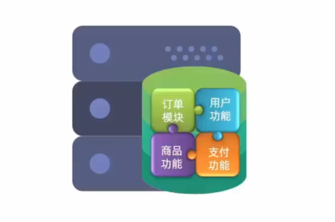

# 微服务前言


**微服务**只是**分布式架构**的一种！

分布式架构就是要把服务做拆分，而拆分的过程中会产生各种各样的问题需要解决，**Spring Cloud**只解决了服务拆分时的**服务治理**问题。


## 微服务技术栈

传统的**单体应用**，所有的业务功能全部写在一起，随着业务功能不断增加，代码耦合的越来越多，不利于将来的升级维护。



微服务在做拆分的时候，会根据业务功能模块将一个单体项目拆分成许多个独立的项目，每个项目完成一部分业务功能，将来独立开发和部署。

我们把这些独立的项目称之为**服务**。一个大型的微服务项目往往会包含数百甚至上千个服务，最终形成一个**服务集群**。


而一个业务往往需要由多个服务共同完成，例如一个请求来了，它可能先去调用服务A，随后服务A会调用服务B，服务B又会调用服务C。

当业务越来越多，越来越复杂的时候，这些服务之间的调用关系就会越来越复杂，而这些复杂的调用关系光靠人去记录和维护这是不可能的。


这个时候就需要用到**注册中心**，它可以去记录每一个服务的IP、端口和功能这些信息。

当有一个服务需要调用另外的服务时，只需要到注册中心中去拉取对应的服务信息。


另外，随着服务越来越多，每个服务都有自己的配置文件，如果我们需要更改配置，逐一更改太麻烦了，所以就需要用到**配置中心**。

它可以去统一管理整个服务集群的成千上百的配置，如果我们需要变更某些配置，只需要通过配置中心去通知相关的微服务实现配置的**热更新**。


当我们的微服务运行起来以后，用户就可以来访问我们了，但是这个时候还需要一个**网关组件**。（就像小区保安，拦截不法分子、指明住户住所）

因为我们有这么多的微服务，用户怎么知道该访问哪一个呢？（**网关组件功能1**：需要把用户的请求路由到具体的服务，同时还可以做**负载均衡**）

而且也不是随便什么人都可以访问我们的微服务的。（**网关组件功能2**：需要对用户的身份做校验）


用户发起访问请求后，服务接到请求就开始处理业务，该访问数据库的时候就会去访问**数据库集群**。


但无论数据库集群有多庞大也不可能有用户多，所以数据库肯定无法抗住高的并发。因此就需要加入**分布式缓存**，它也是一个集群。

缓存会把数据库的数据放到内存中，从而提高查询效率。

通过分布式缓存就可以应对高并发了，用户请求会先查询缓存，缓存未命中了再去查询数据库，从而降低了数据库的查询压力。


以后我们的业务中还会有一些复杂的搜索功能。简单查询可以做缓存，但是一些海量数据的复杂搜索、统计分析无法用缓存去实现，此时就需要用到**分布式搜索**。

数据库的主要职责就是做数据的 **写** 操作，以及一些**事务**类型的，对数据安全要求比较高的数据存储。


最后，在微服务中还需要一种**异步通信**的**消息队列**组件。

因为对于分布式服务（或微服务）来说，它的业务往往会跨越多个服务，例如一个请求来了先调用了服务A，服务A再调用服务B，服务B再调用服务C……这就会导致整个业务的链路很长，从而**调用时长=每个服务的执行时长之和**，所以其性能是有一定的下降的。

而异步通信的意思就是，请求调用服务A之后，服务A不再直接调用服务B，而是通知服务B执行（即发送一条通知消息），随后服务A就直接结束了。这就使得业务链路缩短，响应时间也缩短，进而分布式服务（或微服务）的吞吐能力变强。

- 其中服务A发送的通知消息就存储在消息队列组件中，服务B只有在接收到该消息时才会去执行。（同理，服务B调用服务C也是通知）

所以异步通信能够大大提高我们服务的并发，在一些像“秒杀”这样的高并发场景下就可以去利用了。


当然，如此庞大且复杂的一个服务，在运行的过程中如果出现什么问题是不太好排查的。所以我们需要引入两个新的组件，来解决运行过程中服务的异常定位。

1.**分布式日志服务**：负责统计整个集群中成千上百个服务的运行日志，统一去做存储、统计、分析，方便快速定位服务运行过程中出现的问题。

2.**系统监控+链路追踪**：实时监控整个集群中每个服务节点的运行状态、CPU的负载、内存的占用等情况，一旦出现任何问题，直接可以定位到具体的某一个方法（栈信息），从而帮助我们快速定位到异常所在。


如此庞大且复杂的一个微服务集群，将来其中的服务数量可能上万，届时如何**部署**将成为一个问题。人工部署显然不现实，那么就需要考虑**自动化部署**。

1.**Jenkins**：可以帮助我们对这些微服务项目进行自动化编译

2.**Docker**：基于docker做一些打包，形成镜像

3.**kubernetes**：实现自动化部署

4.**RANCHER**：同上

以上这一套我们称之为**持续集成**


### 分类总结


由浅入深，可以将微服务技术栈做如下分层


# 微服务架构

## 认识微服务

### 1.服务架构演变

==单体架构==：将业务的所有功能集中在一个项目中开发，打成一个包部署。

优点：架构简单；部署成本低。


缺点：耦合度高


==分布式架构==：根据业务功能对系统进行拆分，每个业务模块作为独立项目开发，称为一个服务。

优点：降低服务耦合度；有利于服务升级拓展


（服务治理）分布式架构要考虑的问题：

- 服务拆分粒度如何？
- 服务集群地址如何维护？
- 服务之间如何实现远程调用？
- 服务健康状态如何感知？

为了解决上述问题，诞生了很多解决方案，其中应用最广泛且最火热的就是<span style="color:red;">**微服务**</span>方案：


> 微服务是一种经过良好架构设计的**分布式**架构方案，微服务架构特征：
>
> - 单一职责：微服务拆分粒度更小，每一个服务都对应唯一的业务功能，做到单一职责，避免重复业务开发
> - 面向服务：微服务对外暴露业务接口
> - 自治：团队独立、技术独立、数据独立、部署独立
> - 隔离性：服务调用做好隔离、容错、降级，避免出现级联问题


==总结：==

单体架构特点：

- 简单方便，高度耦合，扩展性差，适合小型项目
- 例如：学生管理系统

分布式架构特点：

- 松耦合，扩展性好，但架构复杂，难度大。适合大型互联网项目
- 例如：京东、淘宝

微服务：一种良好的分布式架构方案

- 优点：拆分粒度更小、服务更独立、耦合度更低
- 缺点：架构非常复杂，运维、监控、部署难度更高


### 2.SpringCloud

#### 微服务技术对比

微服务这种方案需要技术框架来落地，全球的互联网公司都在积极尝试自己的微服务落地技术。国内最知名的就是 <span style="color:red;">**SpringCloud**</span> 和 Alibaba的 <span style="color:red;">**Dubbo**</span> 。

|                |         Dubbo         |       SpringCloud        |    SpringCloudAlibaba    |
| :------------: | :-------------------: | :----------------------: | :----------------------: |
|    注册中心    |   zookeeper、Redis    |      Eureka、Cousul      |      Nacos、Eureka       |
|  服务远程调用  |       Dubbo协议       |    Feign（http协议）     |       Dubbo、Feign       |
|    配置中心    |          无           |   Spring Cloud Config    | SpringCloudConfig、Nacos |
|    服务网关    |          无           | SpringCloudGateway、Zuul | SpringCloudGateway、Zuul |
| 服务监控和保护 | dubbo-admin（功能弱） |         Hystrix          |         Sentinel         |

企业中可能使用到的技术组合如下：


==**SpringCloudAlibaba** 本质上是按照 **SpringCloud** 标准实现的，可以认为它是 **SpringCloud** 中的一部分。==


#### SpringCloud

[SpringCloud](https://spring.io/projects/spring-cloud) 是目前国内使用最广泛的微服务框架。

**SpringCloud** 集成了各种微服务功能组件，并基于 **SpringBoot** 实现了这些组件的<span style="color:red;">自动装配</span>，从而提供了良好的开箱即用体验：


**SpringCloud** 与 **SpringBoot** 的版本兼容关系如下：


## 分布式服务架构案例

### 服务拆分

> ==服务拆分时需要注意的事项：==
>
> 1.不同服务，不要重复开发相同业务
>
> 2.各服务数据独立，不要访问其它服务的数据库
>
> 3.服务可以将自己的业务暴露为接口，供其它服务调用

拆分案例：cloud-demo

#### 1.建库建表 cloud_order


```sql
/*
 Navicat Premium Data Transfer

 Source Server         : local-db
 Source Server Type    : MySQL
 Source Server Version : 80016
 Source Host           : localhost:3306
 Source Schema         : cloud_order

 Target Server Type    : MySQL
 Target Server Version : 80016
 File Encoding         : 65001

 Date: 23/11/2023 16:03:17
*/

SET NAMES utf8mb4;
SET FOREIGN_KEY_CHECKS = 0;

-- ----------------------------
-- Table structure for tb_order
-- ----------------------------
DROP TABLE IF EXISTS `tb_order`;
CREATE TABLE `tb_order`  (
  `id` bigint(20) NOT NULL AUTO_INCREMENT COMMENT '订单id',
  `user_id` bigint(20) NOT NULL COMMENT '用户id',
  `name` varchar(128) CHARACTER SET utf8mb4 COLLATE utf8mb4_general_ci NULL DEFAULT NULL COMMENT '商品名称',
  `price` decimal(10, 2) NOT NULL COMMENT '商品价格',
  `num` int(11) NULL DEFAULT 0 COMMENT '商品数量',
  PRIMARY KEY (`id`) USING BTREE,
  UNIQUE INDEX `ordername`(`name`) USING BTREE
) ENGINE = InnoDB AUTO_INCREMENT = 9 CHARACTER SET = utf8mb4 COLLATE = utf8mb4_general_ci ROW_FORMAT = Dynamic;

-- ----------------------------
-- Records of tb_order
-- ----------------------------
INSERT INTO `tb_order` VALUES (1, 1, 'Apple 苹果 iPhone 12', 699900.00, 1);
INSERT INTO `tb_order` VALUES (2, 2, '雅迪 yadea 新国标电动车', 20990.00, 1);
INSERT INTO `tb_order` VALUES (3, 3, '骆驼（CAMEL） 休闲运动服', 43900.00, 1);
INSERT INTO `tb_order` VALUES (4, 4, '小米14 Pro 双模5G 骁龙8第三代', 35900.00, 1);
INSERT INTO `tb_order` VALUES (5, 5, 'OPPO Reno3 Pro 双模5G', 299900.00, 1);
INSERT INTO `tb_order` VALUES (6, 6, '美的（Midea）新能效空调', 544900.00, 1);
INSERT INTO `tb_order` VALUES (7, 2, '西昊/SIHOO 人体工学椅', 79900.00, 1);
INSERT INTO `tb_order` VALUES (8, 3, '梵班（FAMDBANN）', 31900.00, 1);

SET FOREIGN_KEY_CHECKS = 1;
```


#### 2.建库建表 cloud_user


```sql
/*
 Navicat Premium Data Transfer

 Source Server         : local-db
 Source Server Type    : MySQL
 Source Server Version : 80016
 Source Host           : localhost:3306
 Source Schema         : cloud_user

 Target Server Type    : MySQL
 Target Server Version : 80016
 File Encoding         : 65001

 Date: 23/11/2023 16:03:29
*/

SET NAMES utf8mb4;
SET FOREIGN_KEY_CHECKS = 0;

-- ----------------------------
-- Table structure for tb_user
-- ----------------------------
DROP TABLE IF EXISTS `tb_user`;
CREATE TABLE `tb_user`  (
  `id` bigint(20) NOT NULL AUTO_INCREMENT,
  `username` varchar(128) CHARACTER SET utf8mb4 COLLATE utf8mb4_general_ci NULL DEFAULT NULL COMMENT '收件人',
  `address` varchar(255) CHARACTER SET utf8mb4 COLLATE utf8mb4_general_ci NULL DEFAULT NULL COMMENT '地址',
  PRIMARY KEY (`id`) USING BTREE,
  UNIQUE INDEX `username`(`username`) USING BTREE
) ENGINE = InnoDB AUTO_INCREMENT = 7 CHARACTER SET = utf8mb4 COLLATE = utf8mb4_general_ci ROW_FORMAT = Dynamic;

-- ----------------------------
-- Records of tb_user
-- ----------------------------
INSERT INTO `tb_user` VALUES (1, '柳岩', '湖南省衡阳市');
INSERT INTO `tb_user` VALUES (2, '文二狗', '陕西省西安市');
INSERT INTO `tb_user` VALUES (3, '雨化田', '湖北省十堰市');
INSERT INTO `tb_user` VALUES (4, '张必沉', '天津市');
INSERT INTO `tb_user` VALUES (5, '郑爽爽', '辽宁省沈阳市大东区');
INSERT INTO `tb_user` VALUES (6, '范冰冰', '山东省青岛市');

SET FOREIGN_KEY_CHECKS = 1;
```


#### 3.建项目


- 创建父工程 cloud_demo，pom文件如下：

```xml
<?xml version="1.0" encoding="UTF-8"?>
<project xmlns="http://maven.apache.org/POM/4.0.0"
         xmlns:xsi="http://www.w3.org/2001/XMLSchema-instance"
         xsi:schemaLocation="http://maven.apache.org/POM/4.0.0 http://maven.apache.org/xsd/maven-4.0.0.xsd">
    <modelVersion>4.0.0</modelVersion>

    <groupId>com.djn</groupId>
    <artifactId>cloud-demo</artifactId>
    <packaging>pom</packaging>
    <version>1.0</version>
    <modules>
        <module>order-service</module>
        <module>user-service</module>
    </modules>

    <parent>
        <groupId>org.springframework.boot</groupId>
        <artifactId>spring-boot-starter-parent</artifactId>
        <version>2.6.4</version>
        <relativePath/>
    </parent>

    <properties>
        <project.build.sourceEncoding>UTF-8</project.build.sourceEncoding>
        <project.reporting.outputEncoding>UTF-8</project.reporting.outputEncoding>
        <java.version>1.8</java.version>
        <spring-cloud.version>2021.0.3</spring-cloud.version>
        <mysql.version>8.0.33</mysql.version>
        <mybatis.version>2.2.2</mybatis.version>
    </properties>

    <dependencyManagement>
        <dependencies>
            <!--SpringCloud-->
            <dependency>
                <groupId>org.springframework.cloud</groupId>
                <artifactId>spring-cloud-dependencies</artifactId>
                <version>${spring-cloud.version}</version>
                <type>pom</type>
                <scope>import</scope>
            </dependency>
            <!--数据库驱动 mysql-->
            <dependency>
                <groupId>mysql</groupId>
                <artifactId>mysql-connector-java</artifactId>
                <version>${mysql.version}</version>
            </dependency>
            <!--Mybatis-->
            <dependency>
                <groupId>org.mybatis.spring.boot</groupId>
                <artifactId>mybatis-spring-boot-starter</artifactId>
                <version>${mybatis.version}</version>
            </dependency>
        </dependencies>
    </dependencyManagement>

    <dependencies>
        <dependency>
            <groupId>org.projectlombok</groupId>
            <artifactId>lombok</artifactId>
        </dependency>
    </dependencies>
</project>
```

<span style="color:red;">**关于SpringCloud依赖坐标下的 type 标签和 scope 标签的作用**</span>

**Know1**：Maven项目的父子工程是**单继承**的，即一个 pom 文件中只能有一个 parent 标签

**Know2**：dependencyManagement 标签和 dependencies 标签的区别

> dependencyManagement里只是声明依赖，并不实现引入，因此子项目需要显式的声明需要用的依赖。如果不在子项目中声明依赖，是不会从父项目中继承下来的；只有在子项目中写了该依赖项，并且没有指定具体版本，才会从父项目中继承该项，并且version和scope都读取自父pom。另外如果子项目中指定了版本号，那么会使用子项目中指定的jar版本。
>
> dependencies即使在子模块中不写该依赖项，那么子模块仍然会从父项目中继承该依赖项（全部继承）。
>
> 链接：https://www.jianshu.com/p/c8666474cf9a

**Know3**：通过 `<type>pom</type>` 和 `<scope>import</import>` 可以解决Maven子工程单继承的问题。

 <span style="color:green;">**即 可以在我们的工程中引入多个 pom 工程的 dependencyManagement ，而非只有 parent 标签中的 pom 工程的 dependencyManagement**</span> 

首先，我这个 pom 文件是作为**其它子模块 pom 文件的<span style="color:red;">父类</span>**，在该模块下我使用 <span style="color:red;">parent</span> 标签继承了 SpringBoot 的**所有**依赖(但不是引入jar包！)，这样方便于版本管理。

其次，我<span style="color:red;">还要</span>在项目中用到 SpringCloud 的相关依赖，但是 <span style="color:red;">parent 标签已经被占用了，怎么办？</span>

这时我们就需要使用 ==\<dependencyManagement> + \<dependencies>== 来引入 SpringCloud 的相关依赖，也就是我们常说的需要解决“**Maven依赖单继承问题**”。

```xml
    <dependencyManagement>
        <dependencies>
            <!--SpringCloud-->
            <dependency>
                <groupId>org.springframework.cloud</groupId>
                <artifactId>spring-cloud-dependencies</artifactId>
                <version>${spring-cloud.version}</version>
                <type>pom</type>
                <scope>import</scope>
            </dependency>
        </dependencies>
	</dependencyManagement>
```

一个一个导入会很麻烦而且会使 pom 文件过大，所以官方提供了一个依赖合集——直接引入 **spring-cloud-dependencies**，<span style="color:red;">**即整个cloud的全套的依赖！！**</span>

这样就解决了单继承的问题。要注意的是 `<scope>import</scope>` 必须在 \<dependencyManagement> 下使用并且==<span style="color:red;">必须</span>==声明 `<type>pom</type>` 。

> 当一个父 pom 中的 dependencyManagement 标签中需要导入另一个 pom 中的 dependencyManagement 的时候（此处是想引入 **spring-cloud-dependencies** 工程中的<dependencyManagement>）,则必须同时使用 `<scope>import</scope>` 和 `<type>pom</type>`

==注意：==dependencyManagement 只在父工程（即 pom 类型的 Maven 工程）中声明有效，然后在子工程中引入依赖无需声明版本。**如果在 jar 类型的 maven 工程中添加了 dependencyManagement 是<span style="color:red;">没有意义</span>的。**


- 创建子模块 order_service

pom.xml

```xml
<?xml version="1.0" encoding="UTF-8"?>
<project xmlns="http://maven.apache.org/POM/4.0.0"
         xmlns:xsi="http://www.w3.org/2001/XMLSchema-instance"
         xsi:schemaLocation="http://maven.apache.org/POM/4.0.0 http://maven.apache.org/xsd/maven-4.0.0.xsd">
    <parent>
        <artifactId>cloud-demo</artifactId>
        <groupId>com.djn</groupId>
        <version>1.0</version>
    </parent>
    <modelVersion>4.0.0</modelVersion>

    <artifactId>order-service</artifactId>

    <dependencies>
        <dependency>
            <groupId>org.springframework.boot</groupId>
            <artifactId>spring-boot-starter-web</artifactId>
        </dependency>
        <dependency>
            <groupId>mysql</groupId>
            <artifactId>mysql-connector-java</artifactId>
        </dependency>
        <dependency>
            <groupId>org.mybatis.spring.boot</groupId>
            <artifactId>mybatis-spring-boot-starter</artifactId>
        </dependency>
    </dependencies>

    <build>
        <plugins>
            <plugin>
                <groupId>org.springframework.boot</groupId>
                <artifactId>spring-boot-maven-plugin</artifactId>
            </plugin>
        </plugins>
    </build>
</project>
```

application.yml

```yaml
server:
  port: 9981
spring:
  datasource:
    url: jdbc:mysql://localhost:3306/cloud_order?useUnicode=true&characterEncoding=utf8&zeroDateTimeBehavior=convertToNull&useSSL=false&serverTimezone=Asia/Shanghai
    username: root
    password: 1234
    driver-class-name: com.mysql.cj.jdbc.Driver
mybatis:
  type-aliases-package: com.djn.order.domain
  configuration:
    map-underscore-to-camel-case: true
  mapper-locations: classpath*:mapper/*Mapper.xml
logging:
  pattern:
    dateformat: MM-dd HH:ss:SSS
  level:
    com.djn: debug
```

==业务代码详见项目代码==


- 创建子模块 user_service

pom.xml

```xml
<?xml version="1.0" encoding="UTF-8"?>
<project xmlns="http://maven.apache.org/POM/4.0.0"
         xmlns:xsi="http://www.w3.org/2001/XMLSchema-instance"
         xsi:schemaLocation="http://maven.apache.org/POM/4.0.0 http://maven.apache.org/xsd/maven-4.0.0.xsd">
    <parent>
        <artifactId>cloud-demo</artifactId>
        <groupId>com.djn</groupId>
        <version>1.0</version>
    </parent>
    <modelVersion>4.0.0</modelVersion>

    <artifactId>user-service</artifactId>

    <dependencies>
        <dependency>
            <groupId>org.springframework.boot</groupId>
            <artifactId>spring-boot-starter-web</artifactId>
        </dependency>
        <dependency>
            <groupId>mysql</groupId>
            <artifactId>mysql-connector-java</artifactId>
        </dependency>
        <dependency>
            <groupId>org.mybatis.spring.boot</groupId>
            <artifactId>mybatis-spring-boot-starter</artifactId>
        </dependency>
    </dependencies>

    <build>
        <finalName>app</finalName>
        <plugins>
            <plugin>
                <groupId>org.springframework.boot</groupId>
                <artifactId>spring-boot-maven-plugin</artifactId>
            </plugin>
        </plugins>
    </build>
</project>
```

application.yml

```yaml
server:
  port: 8864
spring:
  datasource:
    url: jdbc:mysql://localhost:3306/cloud_user?useUnicode=true&characterEncoding=utf8&zeroDateTimeBehavior=convertToNull&useSSL=false&serverTimezone=Asia/Shanghai
    username: root
    password: 1234
    driver-class-name: com.mysql.cj.jdbc.Driver
mybatis:
  type-aliases-package: com.djn.user.domain
  configuration:
    map-underscore-to-camel-case: true
  mapper-locations: classpath*:mapper/*Mapper.xml
logging:
  pattern:
    dateformat: MM-dd HH:ss:SSS
  level:
    com.djn: debug
```

==业务代码详见项目代码==


#### 4.启动测试

分别访问两个服务的接口，得到如下结果

http://localhost:9981/order/1


http://localhost:8864/user/1


### 远程调用

案例：根据订单id查询订单的同时，把订单所属的用户信息一起返回


远程调用方式分析


既然浏览器、Ajax都可以发起http请求，那么服务也可以。Spring提供了一个工具 <span style="color:red;">RestTemplate</span> 供我们发起各种http请求！

#### 1.注册RestTemplate

在order-service的**OrderApplication**中注册RestTemplate

```java
@MapperScan("com.djn.order.mapper")
@SpringBootApplication
public class OrderApplication {

    public static void main(String[] args) {
        SpringApplication.run(OrderApplication.class, args);
    }

    /**
     * 创建RestTemplate并注入Spring
     *
     * @return org.springframework.web.client.RestTemplate
     * @date 2023/11/23 18:36
     */
    @Bean
    public RestTemplate restTemplate() {
        return new RestTemplate();
    }
}
```

#### 2.注入并使用

改造OrderServiceImpl，实现服务的远程调用

```java
@Service
public class OrderServiceImpl implements OrderService {

    @Resource
    private OrderMapper orderMapper;

    @Resource
    private RestTemplate restTemplate;

    @Override
    public Order queryOrderById(Long orderId) {
        //1.查询订单
        Order order = orderMapper.findById(orderId);
        //2.利用RestTemplate发起http请求
        //2.1拼接url路径
        String url = "http://localhost:8864/user/" + order.getUserId();
        //2.2发送http请求，实现远程调用
        User user = restTemplate.getForObject(url, User.class);
        //3.封装User到Order
        order.setUser(user);
        //4.返回
        return order;
    }
}
```

#### 3.调用结果


## Eureka注册中心

### 提供者与消费者

服务提供者：一次业务中，被其他服务调用的服务（提供接口给其它服务）

服务消费者：一次业务中，调用其它服务的服务（调用其它服务提供的接口）

~一个服务既可以是提供者，也可以是消费者。例如：当服务A调用服务B，服务B再调用服务C的时候，服务B既是A的提供者，又是C的消费者。~


### Eureka原理分析

#### 远程调用出现的问题

在 **cloud-demo** 的服务拆分案例中，我们在实现远程调用时，是把调用服务的url在代码中写死的，这样非常不灵活。

> 在实际工作中，我们会有 *开发环境* 、*测试环境* 、*生产环境*  等多个环境，在不同的环境中我们服务的地址也会发生变化。如果使用硬编码的方式，每次更换环境都需要我们手动修改地址，重新编译打包，这样非常的麻烦。
>
> 为了将来应对更多的并发，我们的每一种服务都有可能部署多个实例，形成一个集群。此时我们调用的服务的url就变得不确定了，硬编码的方式也变得不切实际了。
>
> - ==那么我们的服务消费者该如何获取服务提供者的地址信息？==
>
> - ==如果有多个服务者，消费者该如何选择？==
> - ==消费者如何得知服务提供者的健康状态？==


#### Eureka的作用

在Eureka的结构当中，存在两个概念：**eureka-server** 和 **eureka-client**。

其中 **注册中心** 就是 eureka-server，它的作用就是记录、管理这些微服务；而 **服务提供者&服务消费者** 统称为 eureka-client，它们每个服务在每次启动时都会把自己的信息注册到 eureka注册中心。


当有服务消费者想要“消费”的时候，就会到 eureka注册中心 拉取目标服务的信息。当目标服务有多个时，可以通过**负载均衡**挑选出一个目标服务以供“消费”。


当然，拉取的目标服务都是健康的，因为已经注册的服务每隔30秒都会向注册中心发送一次心跳，以此来确保自己是健康状态的。所以那些非健康状态的服务信息在被拉取之前就会被筛除掉。


#### 总结

在Eureka架构中，微服务角色有两类：

- EurekaServer：服务端，注册中心
    - 记录服务信息
    - 心跳监控
- EurekaClient：客户端
    - Provider：服务提供者，例如案例中的 user-service
        - 注册自己的信息到EurekaServer
        - 每隔30秒向EurekaServer发送心跳
    - Consumer：服务消费者，例如案例中的 order-service
        - 根据服务名称从EurekaServer拉取服务列表
        - 基于服务列表做负载均衡，选中一个微服务后发起远程调用


### Eureka实用案例

搭建EurekaServer ——> 将user-service、order-service都注册到Eureka ——> 在order-service中完成服务拉取，然后通过负载均衡挑选一个服务实现远程调用

#### 1.搭建注册中心

①创建一个子模块 eureka-server，并引入eureka-server的相关依赖

```xml
<?xml version="1.0" encoding="UTF-8"?>
<project xmlns="http://maven.apache.org/POM/4.0.0"
         xmlns:xsi="http://www.w3.org/2001/XMLSchema-instance"
         xsi:schemaLocation="http://maven.apache.org/POM/4.0.0 http://maven.apache.org/xsd/maven-4.0.0.xsd">
    <modelVersion>4.0.0</modelVersion>
    <parent>
        <groupId>com.djn</groupId>
        <artifactId>cloud-demo</artifactId>
        <version>1.0</version>
    </parent>

    <artifactId>eureka-server</artifactId>

    <properties>
        <maven.compiler.source>8</maven.compiler.source>
        <maven.compiler.target>8</maven.compiler.target>
        <project.build.sourceEncoding>UTF-8</project.build.sourceEncoding>
    </properties>

    <dependencies>
        <!--eureka服务端-->
        <dependency>
            <groupId>org.springframework.cloud</groupId>
            <artifactId>spring-cloud-starter-netflix-eureka-server</artifactId>
        </dependency>
    </dependencies>

</project>
```

②编写启动类 `EurekaApplication`，添加 `@EnableEurekaServer` 注解

```java
package com.djn.eureka;

import org.springframework.boot.SpringApplication;
import org.springframework.boot.autoconfigure.SpringBootApplication;
import org.springframework.cloud.netflix.eureka.server.EnableEurekaServer;

@EnableEurekaServer
@SpringBootApplication
public class EurekaApplication {

    public static void main(String[] args) {
        SpringApplication.run(EurekaApplication.class, args);
    }
}
```

③添加 `application.yml` 文件，编写如下配置

```yaml
server:
  port: 10086 # 服务端口

# 为 Eureka自身的服务注册 而做的配置
spring:
  application:
    name: eurekaServer # Eureka的服务名称
eureka:
  client:
    service-url: # eureka的地址信息
      defaultZone: http://127.0.0.1:10086/eureka
```

==tips：== eureka-server 本质也是一个服务，所以它在启动时会将自身也注册到 eureka 上（这是为了方便将来eureka集群之间的通信），

这就要求我们配置 **defaultZone** 这个属性（单机eureka时只需要写一个地址，eureka集群时配置多个地址用逗号隔开）。

④启动项目并访问url：http://localhost:10086/


图中，EUREKA_SERVER 服务实例的 Status 一栏中的<span style="color:red;">“UP”表示正常状态</span>，如果是<span style="color:blue;">“DOWN”则表示该服务挂掉了</span>。


#### 2.服务注册

需求：将 user-service 服务注册到 eureka-server

①在 user-service 的 pom 文件中引入如下依赖

```xml
<!--eureka客户端-->
<dependency>
    <groupId>org.springframework.cloud</groupId>
    <artifactId>spring-cloud-starter-netflix-eureka-client</artifactId>
</dependency>
```

②在 application.yml 文件中编写如下配置

```yaml
spring:
  application:
    name: userService # user服务的服务名称
eureka:
  client:
    service-url: # eureka的地址信息
      defaultZone: http://127.0.0.1:10086/eureka/
```

③ order-service 的注册步骤同理，启动项目后到 eureka 中查看注册的服务实例


④==如何启动多个相同的服务==

我们可以将一个服务多次启动，模拟多实例部署，但为了避免端口冲突，需要修改端口配置：

第一步：


第二步：


第三步：


最终效果：


#### 3.服务发现

需求：在 order-service 完成服务拉取

~服务拉取是基于服务名称获取服务列表，然后再对服务列表做负载均衡~

①修改 order-service 的代码，修改访问user服务的url路径：用服务名称代替ip、端口

```java
String url = "http://userservice/user/" + order.getUserId();
```

②在 order-service 项目的启动类中注册RestTemplate时，添加**负载均衡**注解

```java
@Bean
@LoadBalanced
public RestTemplate restTemplate() {
    return new RestTemplate();
}
```

③重启 order-service 项目后，对服务接口进行多次访问，可以看到每次访问都会<span style="color:red;">通过负载均衡做不同的 user-service 服务调用</span>


## 负载均衡

SpringCloud 中的负载均衡一开始是由一个名为 Ribbon 的组件实现的；<span style="color:red;">**但由于 Ribbon 已经停更，SpringCloud 在 Hoxton.M2 版本将 Ribbon 移除，并使用 SpringCloud Loadbalancer作为其替代品！**</span>


二者区别

|           组件           | 组件提供的负载策略                                           | 支持负载的客户端                            |
| :----------------------: | :----------------------------------------------------------- | :------------------------------------------ |
|          Ribbon          | 轮询、随机、重试策略、权重优先策略、<br/>BestAvailableRule：会先过滤掉由于多次访问故障而处于断路器跳闸状态的服务，然后选择一个并发量最小的服务、<br/>AvailabilityFilterRule：先过滤掉故障实例，再选择并发较小的实例、<br/>ZoneAvoidanceRule：默认规则，复合判断server所在区域的性能和server的可用性选择服务器 | Feign或OpenFeign、RestTemplate等Web调用工具 |
| SpringCloud Loadbalancer | 轮询、随机                                                   | Ribbon所支持的、WebClient                   |

LoadBalancer 的优势主要是，支持**响应式编程**的方式**异步访问**客户端，依赖 Spring Web Flux 实现客户端负载均衡调用。


### 负载均衡原理

*负载均衡的流程*（图中SpringCloud版本较低，所以还在使用Ribbon做负载均衡）


在 Eureka实用案例 中，做“服务发现”时我们在给 RestTemplate 注册时加上了**负载均衡**注解


在 `LoadBalancerAutoConfiguration` 自动配置类中会给标有 @LoadBalanced 注解的 RestTemplate 添加一个负载均衡拦截器，这样就能通过 **LoadBalancerInterceptor** 去添加负载均衡策略

```java
/**
 * 对 阻塞客户端负载均衡 的自动配置
 * Auto-configuration for blocking client-side load balancing.
 *
 * @author Spencer Gibb
 * @author Dave Syer
 * @author Will Tran
 * @author Gang Li
 * @author Olga Maciaszek-Sharma
 */
@Configuration(proxyBeanMethods = false)
@ConditionalOnClass(RestTemplate.class)
@ConditionalOnBean(LoadBalancerClient.class)
@EnableConfigurationProperties(LoadBalancerClientsProperties.class)
public class LoadBalancerAutoConfiguration {

    /**
     * 会注入标有 @LoadBalanced 注解的 RestTemplate
     */
	@LoadBalanced
	@Autowired(required = false)
	private List<RestTemplate> restTemplates = Collections.emptyList();

	@Autowired(required = false)
	private List<LoadBalancerRequestTransformer> transformers = Collections.emptyList();

    // 函数名：负载均衡RestTemplate初始化器弃用后，返回智能初始化单例对象
    // 推测：该函数的作用是 注册一个 “当RestTemplate设置负载均衡拦截器失败后，会被调用来给RestTemplate设置负载均衡拦截器” 的单实例对象
	@Bean
	public SmartInitializingSingleton loadBalancedRestTemplateInitializerDeprecated(
			final ObjectProvider<List<RestTemplateCustomizer>> restTemplateCustomizers) {
		return () -> restTemplateCustomizers.ifAvailable(customizers -> {
			for (RestTemplate restTemplate : LoadBalancerAutoConfiguration.this.restTemplates) {
				for (RestTemplateCustomizer customizer : customizers) {
					customizer.customize(restTemplate);
				}
			}
		});
	}

	@Bean
	@ConditionalOnMissingBean
	public LoadBalancerRequestFactory loadBalancerRequestFactory(LoadBalancerClient loadBalancerClient) {
		return new LoadBalancerRequestFactory(loadBalancerClient, this.transformers);
	}

    // 在静态内部类中 配置负载均衡拦截器 和 RestTemplate定制器
	@Configuration(proxyBeanMethods = false)
	@Conditional(RetryMissingOrDisabledCondition.class)
	static class LoadBalancerInterceptorConfig {

		@Bean
		public LoadBalancerInterceptor loadBalancerInterceptor(LoadBalancerClient loadBalancerClient,
				LoadBalancerRequestFactory requestFactory) {
            // 返回创建的 LoadBalancerInterceptor 负载均衡拦截器实例对象
			return new LoadBalancerInterceptor(loadBalancerClient, requestFactory);
		}

		@Bean
		@ConditionalOnMissingBean
		public RestTemplateCustomizer restTemplateCustomizer(final LoadBalancerInterceptor loadBalancerInterceptor) {
            // 给 RestTemplate 添加 LoadBalancerInterceptor 负载均衡拦截器
			return restTemplate -> {
				List<ClientHttpRequestInterceptor> list = new ArrayList<>(restTemplate.getInterceptors());
				list.add(loadBalancerInterceptor);
				restTemplate.setInterceptors(list);
			};
		}

	}
    
    // 略...
}
```

负责执行拦截动作的是 **LoadBalancerInterceptor** 类


**LoadBalancerInterceptor** 实现了 **ClientHttpRequestInterceptor** 接口。


当我们给 **LoadBalancerInterceptor** 的 *intercept* 方法打上断点后，会发现它拦截了 RestTemplate 发起的HTTP请求


在SpringCloud Loadbalancer 替代 Ribbon 后，上图中负责执行负载均衡策略的实现类也就从 **RibbonLoadBalancerClient** 变成了 **BlockingLoadBalanerClient**，在实现类的 *execute* 方法中会执行负载均衡策略


把断点打到 *choose* 方法中后，可以看到其实是通过 **RoundRobinLoadBalancer** 的负载均衡策略来获取最终的目标服务实例的


通过 `Ctrl` + `H` 我们可以看到 **ReactiveLoadBalancer** 的层级结构如下，其中 **RoundRobinLoadBalancer** 是它的<span style="color:red;">子实现类</span>


在 **RoundRobinLoadBalancer** 中，是如何获取到 Eureka 中注册的服务列表的呢？


#### 时序流程图

==对 RestTemplate 请求调用时经过的类流程图如下：==


*负载均衡的详细流程*


### 负载均衡策略

Ribbon 的负载均衡规则是一个叫做 **IRule** 的接口来定义的，每一个子接口都是一种规则


### 懒加载


## nacos注册中心