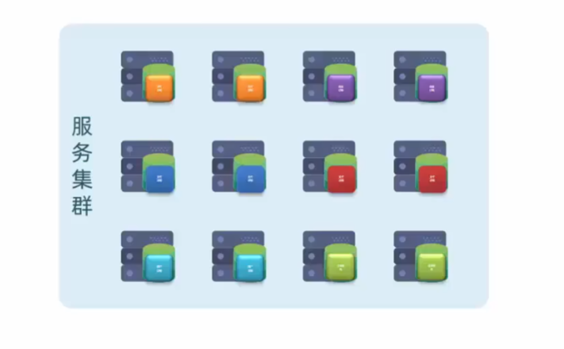
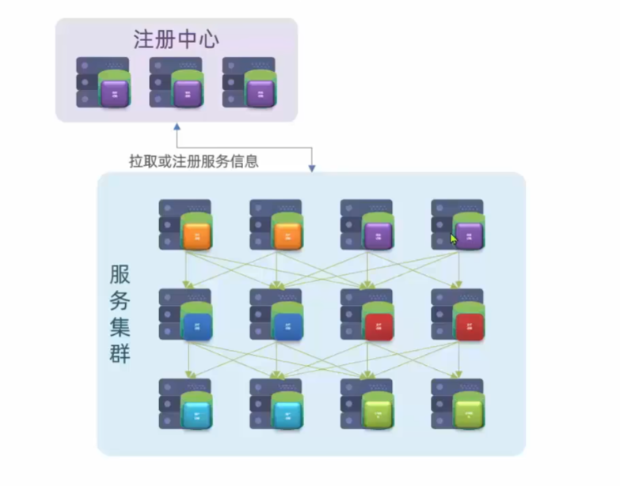

# 微服务前言

**微服务**只是**分布式架构**的一种！

分布式架构就是要把服务做拆分，而拆分的过程中会产生各种各样的问题需要解决，**Spring Cloud**只解决了服务拆分时的**服务治理**问题。

## 微服务技术栈

传统的**单体应用**，所有的业务功能全部写在一起，随着业务功能不断增加，代码耦合的越来越多，不利于将来的升级维护。

微服务在做拆分的时候，会根据业务功能模块将一个单体项目拆分成许多个独立的项目，每个项目完成一部分业务功能，将来独立开发和部署。

我们把这些独立的项目称之为**服务**。一个大型的微服务项目往往会包含数百甚至上千个服务，最终形成一个**服务集群**。

而一个业务往往需要由多个服务共同完成，例如一个请求来了，它可能先去调用服务A，随后服务A会调用服务B，服务B又会调用服务C。

当业务越来越多，越来越复杂的时候，这些服务之间的调用关系就会越来越复杂，而这些复杂的调用关系光靠人去记录和维护这是不可能的。

这个时候就需要用到**注册中心**，它可以去记录每一个服务的IP、端口和功能这些信息。

当有一个服务需要调用另外的服务时，只需要到注册中心中去拉取对应的服务信息。

另外，随着服务越来越多，每个服务都有自己的配置文件，如果我们需要更改配置，逐一更改太麻烦了，所以就需要用到**配置中心**。

它可以去统一管理整个服务集群的成千上百的配置，如果我们需要变更某些配置，只需要通过配置中心去通知相关的微服务实现配置的**热更新**。

当我们的微服务运行起来以后，用户就可以来访问我们了，但是这个时候还需要一个**网关组件**。（就像小区保安，拦截不法分子、指明住户住所）

因为我们有这么多的微服务，用户怎么知道该访问哪一个呢？（**网关组件功能1**：需要把用户的请求路由到具体的服务，同时还可以做**负载均衡**）

而且也不是随便什么人都可以访问我们的微服务的。（**网关组件功能2**：需要对用户的身份做校验）

用户发起访问请求后，服务接到请求就开始处理业务，该访问数据库的时候就会去访问**数据库集群**。

但无论数据库集群有多庞大也不可能有用户多，所以数据库肯定无法抗住高的并发。因此就需要加入**分布式缓存**，它也是一个集群。

缓存会把数据库的数据放到内存中，从而提高查询效率。

通过分布式缓存就可以应对高并发了，用户请求会先查询缓存，缓存未命中了再去查询数据库，从而降低了数据库的查询压力。

以后我们的业务中还会有一些复杂的搜索功能。简单查询可以做缓存，但是一些海量数据的复杂搜索、统计分析无法用缓存去实现，此时就需要用到**分布式搜索**。

数据库的主要职责就是做数据的 **写** 操作，以及一些**事务**类型的，对数据安全要求比较高的数据存储。

最后，在微服务中还需要一种**异步通信**的**消息队列**组件。

因为对于分布式服务（或微服务）来说，它的业务往往会跨越多个服务，例如一个请求来了先调用了服务A，服务A再调用服务B，服务B再调用服务C……这就会导致整个业务的链路很长，从而**调用时长=每个服务的执行时长之和**，所以其性能是有一定的下降的。

而异步通信的意思就是，请求调用服务A之后，服务A不再直接调用服务B，而是通知服务B执行（即发送一条通知消息），随后服务A就直接结束了。这就使得业务链路缩短，响应时间也缩短，进而分布式服务（或微服务）的吞吐能力变强。

- 其中服务A发送的通知消息就存储在消息队列组件中，服务B只有在接收到该消息时才会去执行。（同理，服务B调用服务C也是通知）

所以异步通信能够大大提高我们服务的并发，在一些像“秒杀”这样的高并发场景下就可以去利用了。

当然，如此庞大且复杂的一个服务，在运行的过程中如果出现什么问题是不太好排查的。所以我们需要引入两个新的组件，来解决运行过程中服务的异常定位。

1.**分布式日志服务**：负责统计整个集群中成千上百个服务的运行日志，统一去做存储、统计、分析，方便快速定位服务运行过程中出现的问题。

2.**系统监控+链路追踪**：实时监控整个集群中每个服务节点的运行状态、CPU的负载、内存的占用等情况，一旦出现任何问题，直接可以定位到具体的某一个方法（栈信息），从而帮助我们快速定位到异常所在。

如此庞大且复杂的一个微服务集群，将来其中的服务数量可能上万，届时如何**部署**将成为一个问题。人工部署显然不现实，那么就需要考虑**自动化部署**。

1.**Jenkins**：可以帮助我们对这些微服务项目进行自动化编译

2.**Docker**：基于docker做一些打包，形成镜像

3.**kubernetes**：实现自动化部署

4.**RANCHER**：同上

以上这一套我们称之为**持续集成**

### 分类总结

123